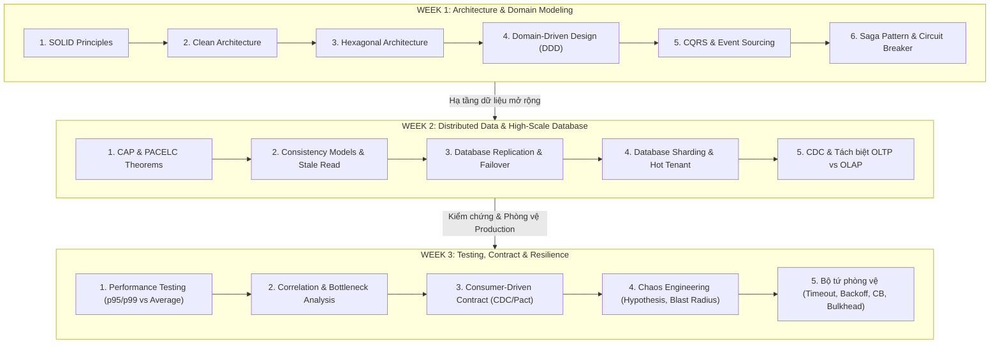

# TÀI LIỆU ÔN TẬP TOÀN DIỆN KIẾN THỨC WEEK 1 - WEEK 2 - WEEK 3
**Dành cho Kỹ sư phần mềm (Định hướng SE Dev 3 / Senior Architect)**  
**Dự án ứng dụng thực chiến xuyên suốt:** *Hệ thống Thương Mại Điện Tử & Flash Sale phân tán (FlashRetail)*

---

## 🗺️ TỔNG QUAN HÀNH TRÌNH KIẾN THỨC 3 TUẦN



---

# PHẦN 1: TỔNG HỢP KIẾN THỨC CỐT LÕI (WEEK 1 → WEEK 3)

---

## 🏛️ CHƯƠNG I: WEEK 1 — KIẾN TRÚC PHẦN MỀM & MẪU THIẾT KẾ PHÂN TÁN

### 1. SOLID Principles — Bản chất & Tử huyệt nhận thức
*   **S - Single Responsibility Principle (SRP):**
    *   *Bản chất:* "Một class chỉ nên có một lý do duy nhất để thay đổi" (gắn liền với **một Actor/Stakeholder nghiệp vụ cụ thể**).
    *   *Hiểu sai phổ biến:* "Một class chỉ được làm 1 hàm". Sai! Một class có thể có 10 hàm, miễn là tất cả các hàm đó phục vụ chung một đối tượng nghiệp vụ (ví dụ: `OrderRepository` chỉ phục vụ việc lưu trữ Order, không kiêm tính thuế hay gửi email).
    *   *Hậu quả khi vi phạm:* Sửa template email cho Marketing làm crash logic tính tiền của Finance.
*   **O - Open/Closed Principle (OCP):**
    *   *Bản chất:* "Mở cho mở rộng (Extension), đóng cho sửa đổi (Modification)".
    *   *Tử huyệt:* Xuất hiện chuỗi `if (type.equals("VNPAY")) ... else if (type.equals("MOMO")) ...`. Khi thêm cổng thanh toán mới, bắt buộc phải mở class cũ ra sửa.
    *   *Giải pháp:* Dùng **Polymorphism + Strategy Pattern + Spring Dependency Injection** (hoặc Factory Map).
*   **L - Liskov Substitution Principle (LSP):**
    *   *Bản chất:* Class con phải thay thế được class cha mà không làm thay đổi tính đúng đắn của chương trình.
    *   *Dấu hiệu vi phạm:* Override method của cha nhưng `throw new UnsupportedOperationException()`, hoặc kiểm tra `if (shape instanceof Square)`.
*   **I - Interface Segregation Principle (ISP):**
    *   *Bản chất:* Client không nên bị ép phụ thuộc vào những method mà nó không sử dụng (Role Interface thay vì Fat Interface).
*   **D - Dependency Inversion Principle (DIP):**
    *   *Bản chất:* Module cấp cao (Business Logic) không được phụ thuộc trực tiếp vào Module cấp thấp (MySQL, Redis, Stripe, MailGun). Cả hai phải phụ thuộc vào Abstraction (Interface).
    *   *Giá trị sống còn:* Phục vụ **Unit Test độc lập**. Ta có thể inject Mock/Stub Repository vào để test business logic trong 5ms mà không cần bật MySQL thật.

---

### 2. Clean Architecture & Hexagonal Architecture (Ports & Adapters)
*   **Dependency Rule:** Mọi phụ thuộc mã nguồn chỉ được hướng **TỪ NGOÀI VÀO TRONG**:
    $$\text{Frameworks/Drivers} \longrightarrow \text{Adapters (Controllers/Repos)} \longrightarrow \text{Use Cases} \longrightarrow \text{Entities (Core Domain)}$$
*   **Core Domain độc lập tuyệt đối:**
    *   Class trong Domain/Entity là Pure Java POJO, **không `@Entity`, không `@Table`, không Spring `@Component`**.
*   **Inbound vs Outbound Ports & Adapters:**
    *   **Inbound Port (Primary):** Interface định nghĩa usecase mà bên ngoài gọi vào Core (vd: `CreateOrderUseCase`).
    *   **Inbound Adapter:** REST Controller, gRPC Handler, RabbitMQ Consumer.
    *   **Outbound Port (Secondary):** Interface định nghĩa nhu cầu của Core cần bên ngoài cung cấp (vd: `OrderRepository`, `PaymentGateway`).
    *   **Outbound Adapter:** `JpaOrderRepositoryAdapter`, `VnPayPaymentAdapter`.

---

### 3. Domain-Driven Design (DDD)
*   **Entity vs Value Object (VO):**
    | Đặc tính | Entity | Value Object (VO) |
    | :--- | :--- | :--- |
    | **Định danh (Identity)** | Có ID duy nhất xuyên suốt vòng đời (`OrderId`, `UserId`). | Không có ID. Hai VO bằng nhau nếu các thuộc tính bằng nhau. |
    | **Tính biến đổi (Mutability)** | Mutable (trạng thái thay đổi theo thời gian). | **Immutable (Bất biến)**. Muốn đổi phải tạo instance mới. |
    | **Logic tự thân** | Quản lý vòng đời và hành vi. | Tự validate tính hợp lệ ngay trong Constructor (`Money`, `Email`). |
*   **Aggregate & Aggregate Root (AR):**
    *   Là ranh giới bảo vệ tính toàn vẹn (Invariant). Mọi thay đổi dữ liệu bên trong Aggregate bắt buộc phải đi qua method của **Aggregate Root**. Không được chọc thẳng vào các Entity con.
*   **Domain Event:**
    *   Thể hiện điều gì đó có ý nghĩa đã xảy ra trong quá khứ (`OrderPlacedEvent`, `PaymentFailedEvent`). Đảm bảo Event là Immutable.

---

### 4. CQRS (Command Query Responsibility Segregation) & Event Sourcing
*   **CQRS:**
    *   *Command Model (Ghi):* Thực thi Invariants, bảo vệ tính toàn vẹn, chuẩn hóa (3NF), trả về `void` hoặc `Id`.
    *   *Query Model (Đọc):* Phi chuẩn hóa (Denormalized), DTO phẳng, không có side-effect, tối ưu hóa cho UI và tốc độ đọc (Elasticsearch, Read Replicas, Redis).
*   **Event Sourcing:**
    *   Thay vì chỉ lưu trạng thái cuối cùng (Current State: `balance = $70`), ta lưu **toàn bộ chuỗi các sự kiện đã xảy ra** (`Created($100)`, `Withdrawn($30)`).
    *   *Append-only Event Store:* Không `UPDATE`, không `DELETE`.
    *   *Replay:* Khôi phục lại State tại bất kỳ thời điểm nào trong quá khứ (Time Travel, Audit Trail).
    *   *Snapshot Pattern:* Cứ sau mỗi $N$ sự kiện (vd: 100 events), lưu lại 1 Snapshot trạng thái để tránh phải replay từ đầu.

---

### 5. Saga Pattern (Distributed Transactions)
*   Trong Microservices, không thể dùng `@Transactional` phân tán (2PC quá chậm và dễ gây lock chết). Saga chia nhỏ thành chuỗi **Local Transactions**.
*   **Compensating Transaction (Giao dịch bù trừ):** Nếu bước thứ $k$ thất bại, hệ thống tự động kích hoạt các hành động bù trừ từ bước $k-1$ lùi về bước 1 theo thứ tự **LIFO**.
*   **Choreography vs Orchestration:**
    *   *Choreography (Phi tập trung):* Các service tự lắng nghe event của nhau qua Message Queue. Thích hợp cho flow ngắn (2-3 bước). Nhược điểm: khó trace, dễ vòng lặp vô tận (cyclic dependency).
    *   *Orchestration (Tập trung):* Một `SagaOrchestrator` trung tâm điều khiển toàn bộ luồng, quyết định khi nào gọi service nào và khi nào rollback. Rõ ràng, dễ theo dõi, phù hợp quy trình phức tạp.
*   **Idempotency (Tính bất biến với số lần gọi):** Bắt buộc mọi API tham gia Saga phải có cơ chế Idempotency Key để xử lý an toàn khi mạng chập chờn gây gửi trùng message/request.

---

### 6. Circuit Breaker Pattern (Chống sập dây chuyền)
*   **Mục đích:** Ngăn chặn một downstream service bị chậm hoặc sập kéo cạn kiệt tài nguyên (Thread Pool, DB Connection) của service gọi nó (**Cascading Failure**).
*   **3 trạng thái:**
    *   `CLOSED`: Hoạt động bình thường. Cho mọi request đi qua. Đếm tỷ lệ lỗi.
    *   `OPEN`: Khi tỷ lệ lỗi vượt ngưỡng (Failure Threshold). **Ngắt mạch ngay lập tức (Fast-Fail)**, ném Exception hoặc trả về Fallback, không thèm gửi request đến downstream.
    *   `HALF-OPEN`: Sau khoảng thời gian chờ (Wait Duration). Cho phép một lượng nhỏ request thử nghiệm đi qua. Nếu thành công $\rightarrow$ chuyển về `CLOSED`; nếu vẫn lỗi $\rightarrow$ quay lại `OPEN`.
*   **Ý nghĩa Fallback:** Trả về kết quả dự phòng hợp lý (vd: lấy data từ Cache cũ, trả về danh sách rỗng, thông báo hệ thống bảo trì nhẹ nhàng).

---

## 🌐 CHƯƠNG II: WEEK 2 — HỆ THỐNG PHÂN TÁN & CƠ SỞ DỮ LIỆU QUY MÔ LỚN

### 1. CAP & PACELC Theorem
*   **CAP Theorem:** Trong mạng phân tán, khi xảy ra sự cố đứt mạng (**Partition - P**), hệ thống bắt buộc phải đánh đổi giữa **Consistency (C - Linearizable)** và **Availability (A)**:
    *   *Chọn CP:* Thà từ chối phục vụ (Fail-fast/Error) để giữ số liệu đúng 100% (Bắt buộc cho Thanh toán, Chuyển tiền ngân hàng, Trừ tồn kho).
    *   *Chọn AP:* Luôn trả về kết quả cho khách, chấp nhận dữ liệu có thể cũ hoặc lệch tạm thời (Thích hợp cho News feed, Like/Comment, Catalog sản phẩm).
*   **PACELC Theorem:** Phần mở rộng cho 99.9% thời gian khi **mạng bình thường (Else - E)**:
    *   Đánh đổi giữa **Latency (L)** và **Consistency (C)**.
    *   *PC/EC:* Ưu tiên nhất quán cả khi đứt mạng lẫn khi bình thường (chấp nhận latency cao hơn).
    *   *PA/EL:* Ưu tiên sẵn sàng và phản hồi cực nhanh, chấp nhận Eventual Consistency.

---

### 2. Consistency Models & Sự cố Stale Read
*   **Các cấp độ nhất quán:**
    1.  **Strong / Linearizable Consistency:** Đọc ngay sau ghi chắc chắn thấy dữ liệu mới nhất.
    2.  **Eventual Consistency:** Dữ liệu sẽ đồng nhất sau một khoảng thời gian trễ.
    3.  **Read-Your-Writes Consistency:** Người dùng sau khi thực hiện ghi dữ liệu chắc chắn sẽ đọc được chính dữ liệu mà họ vừa ghi.
*   **Sự cố Đổi mật khẩu / Replica Lag:**
    *   *Hiện tượng:* User đổi mật khẩu trên Primary DB. Bấm Login ngay lập tức, request đọc đi vào Replica DB. Do **Replication Lag (1-3s)**, Replica chưa kịp nhận Binlog $\rightarrow$ Báo lỗi *"Sai mật khẩu"*!
    *   *Giải pháp:*
        *   Định tuyến 100% request xác thực nhạy cảm về Primary DB.
        *   **Time-window Routing:** Sau khi user thực hiện Write, ghim session của user đó đọc từ Primary DB trong vòng $N$ giây (vd: 3-5s).
        *   **Return-on-Write:** Trả về object mới trực tiếp trong API response thay vì bắt frontend gọi lại `GET`.

---

### 3. Database Replication & Failover
*   **Mô hình:** 1 Primary (Write & Read) + $N$ Read Replicas (Chỉ đọc).
*   **Bản chất:** Chỉ giải quyết **Read Scaling** (mở rộng đọc) và High Availability (HA). **Tuyệt đối KHÔNG giải quyết được Write Bottleneck**.
*   **3 Chiến lược Replication:**
    | Tiêu chí | Synchronous | Semi-Synchronous | Asynchronous |
    | :--- | :--- | :--- | :--- |
    | **Write Latency** | Cao nhất (chờ tất cả Replicas) | Vừa phải (chờ 1 Replica nhận log) | Thấp nhất (Primary ghi disk là xong) |
    | **Data Loss Window** | 0% (Không bao giờ mất) | Gần như 0% (Triệt tiêu rủi ro) | Có rủi ro mất dữ liệu nếu Primary chết đột tử |
    | **Use Case phù hợp** | Cực kỳ khắt khe (Core Banking) | Giao dịch tài chính, Thanh toán, Đơn hàng | Product Catalog, Log, Tracking, Analytics |
*   **Failover & Chống Split-Brain:**
    *   Khi Primary chết, cơ chế Quorum bầu Replica có **LSN (Log Sequence Number) cao nhất** làm Primary mới.
    *   Phải có cơ chế **Fencing / STONITH (Shoot The Other Node In The Head)** để cách ly Primary cũ, ngăn tình trạng cả 2 node cùng tưởng mình là Leader (Split-Brain) gây ghi đè dữ liệu rác.

---

### 4. Database Sharding & Kiến trúc Dữ liệu quy mô lớn
*   **Sharding (Phân mảnh ngang):** Chia bảng dữ liệu ra nhiều server vật lý độc lập. Giải quyết **Write Scaling** và **Storage Scaling**.
*   **Tiêu chuẩn chọn Shard Key:**
    *   High Cardinality (đa dạng giá trị), Even Distribution (phân bổ đều).
    *   Phục vụ cho 90%+ query thường nhật (tránh Scatter-Gather query quét toàn bộ các shard).
    *   Ví dụ E-commerce: Shard theo `customer_id`.
*   **3 Chiến lược Sharding:**
    1.  *Range-based:* Dễ chia theo ngày tháng/ID range, nhưng dễ bị **Hot Shard** ở dải dữ liệu mới nhất.
    2.  *Hash-based:* Dàn đều dữ liệu nhờ hàm băm, nhưng re-shard rất phức tạp nếu không dùng Consistent Hashing.
    3.  *Directory-based (Lookup Table trên Redis):* Cực kỳ linh hoạt, cho phép ánh xạ động `tenant_id` $\rightarrow$ `shard_id`.
*   **Hot Tenant / Noisy Neighbor:** Một Seller/Tenant khổng lồ tạo tải gấp 100 lần các tenant khác. Giải pháp: Dùng Directory-based Sharding cô lập Tenant này vào một **Dedicated Shard** riêng biệt.
*   **Tách biệt tuyệt đối OLTP và OLAP:**
    *   Không chạy query báo cáo/thống kê triệu dòng trên database giao dịch.
    *   Dùng **CDC (Change Data Capture - Debezium + Kafka)** stream dữ liệu sang Columnar Database (ClickHouse, BigQuery) để chạy phân tích tốc độ cao mà không làm chậm việc bán hàng.
*   **Quy trình Zero-downtime Re-sharding (4 bước):**
    $$\text{Snapshot Data cũ} \longrightarrow \text{CDC Stream bù dữ liệu Realtime} \longrightarrow \text{Switch Shard Router (<1ms)} \longrightarrow \text{Cleanup Data cũ}$$

---

## ⚡ CHƯƠNG III: WEEK 3 — KIỂM THỬ HIỆU NĂNG, HỢP ĐỒNG GIAO TIẾP & ĐỘ KIÊN CƯỜNG HỆ THỐNG

### 1. Performance Testing & Phân tích Bottleneck
*   **"Kẻ nói dối" Average Latency:**
    *   Average latency làm phẳng số liệu. 900 request mất 10ms nhưng 100 request mất 8000ms $\rightarrow$ Average chỉ ~800ms, nhưng thực tế 10% khách hàng đã bỏ đi vì website đơ!
    *   **Bắt buộc phải đo:** **p95, p99 (Percentiles)** và **Error Rate**.
*   **Tương quan chỉ số (Correlation Analysis) - Đọc bệnh hệ thống:**
    *   *App CPU 60%, DB CPU 99%, DB Connection Pool 100/100:* **Bottleneck tại Database** (Thiếu Index, Lock Contention, N+1 query, Connection Pool cạn).
        *   *Sai lầm chết người:* Scale-out thêm App Pod $\rightarrow$ Hàng loạt App Pod mới cùng xông vào tranh giành DB Connection $\rightarrow$ DB sập nhanh hơn!
    *   *App CPU 98%, DB CPU 25%:* **Bottleneck tại Application** (Xử lý thuật toán kém, JSON parsing nặng, GC Pauses do leak memory, Blocking I/O).
    *   *App CPU thấp, DB CPU thấp, Latency tăng vọt:* **Bottleneck tại Downstream Service / Network** (Chờ API thanh toán bên thứ 3 mà không có Timeout/Bulkhead).

---

### 2. Contract Testing & Consumer-Driven Contracts (CDC / Pact)
*   **Vì sao Unit Test & Mock lại "phản bội" bạn trên Production?**
    *   Order Service mock Product Service: `when(p.get()).thenReturn(oldProduct)`. Unit test Order xanh.
    *   Product Service team refactor: Đổi field `price` thành `unitPrice`, xóa field `available`. Unit test Product xanh.
    *   Deploy lên Staging/Prod: Order Service deserialize lỗi JSON $\rightarrow$ Toàn bộ luồng mua hàng sụp đổ (**Contract Drift**)!
*   **Giải pháp Consumer-Driven Contract (CDC):**
    1.  Consumer (Order) viết bản cam kết (Pact File) nêu rõ các fields nó thực sự cần.
    2.  Pact File đẩy lên Pact Broker.
    3.  CI/CD của Provider (Product) tự động kéo Pact về chạy Provider Verification.
    4.  Nếu Provider đổi code làm gãy Pact $\rightarrow$ **Build CI của Provider lập tức FAIL**, chặn đứng việc deploy breaking change!
*   **Quy trình API Evolution an toàn (Backward Compatibility):**
    $$\text{Thêm field mới song song field cũ} \longrightarrow \text{Đánh dấu @Deprecated} \longrightarrow \text{Chờ Consumer migrate} \longrightarrow \text{Mới xóa field cũ}$$

---

### 3. Chaos Engineering & Bộ tứ phòng vệ (Resilience Quartet)
*   **Bản chất của Chaos Engineering:**
    *   Không phải đập phá bừa bãi! Là thực nghiệm khoa học:
        1.  *Hypothesis (Giả thuyết):* "Nếu Inventory Service chậm 3 giây, Order Service vẫn phản hồi trong 800ms và không ảnh hưởng API Get Order".
        2.  *Blast Radius (Phạm vi ảnh hưởng):* Chỉ inject lỗi trên 5% user thử nghiệm hoặc môi trường Staging.
        3.  *Abort Condition (Điều kiện dừng khẩn cấp):* Dừng ngay lập tức nếu Error Rate trên hệ thống vượt quá 2%.
*   **Bộ tứ phòng vệ (Resilience Quartet) chống Cascading Failure:**
    1.  **Timeout hợp lý:** Không bao giờ để timeout 30s mặc định. Đặt timeout ngắn (vd: 800ms - 1.5s) để giải phóng thread.
    2.  **Retry thông minh:** Chỉ retry các thao tác **Idempotent**. Tuyệt đối không retry mù quáng dồn dập $\rightarrow$ Bắt buộc dùng **Exponential Backoff + Jitter** để tránh giẫm đạp (Thundering Herd).
    3.  **Circuit Breaker:** Fast-fail khi lỗi vượt ngưỡng, cho downstream thời gian hồi sức.
    4.  **Bulkhead (Vách ngăn khoang tàu):** Tách riêng Thread Pool / Connection Pool cho từng API. Không để API gọi Inventory chậm chiếm hết toàn bộ worker threads của cả server, làm kẹt luôn API `GET /orders`.

---

# PHẦN 2: VÍ DỤ TỔNG HỢP LIÊN HOÀN (CLEAN ARCHITECTURE + DDD + SAGA + RESILIENCE)

Để kiến thức không bị rời rạc, dưới đây là **một ví dụ mã nguồn Java chuẩn chỉnh** trong bài toán Checkout đơn hàng Flash Sale, kết hợp nhuần nhuyễn:
1. **Clean & Hexagonal Architecture:** Domain POJO độc lập, phân tách rõ Inbound / Outbound Ports.
2. **DDD:** Value Object `Money`, Entity `Order` đóng vai trò Aggregate Root bảo vệ Invariant.
3. **CQRS:** Tách Command `PlaceOrderCommand`.
4. **Resilience & Circuit Breaker:** Bảo vệ việc gọi Payment & Inventory với Timeout, Retry Backoff và Fallback.
5. **Idempotency:** Ngăn chặn trừ tiền 2 lần khi mạng chập chờn.

### Cấu trúc gói dự án (Package Structure)
```text
com.flashretail.order
├── domain                     # CORE DOMAIN (Pure Java POJO - Không phụ thuộc Framework)
│   ├── model
│   │   ├── Money.java         # Value Object (Immutable, tự validate)
│   │   ├── OrderId.java       # Value Object định danh
│   │   ├── OrderStatus.java   # Domain Enum
│   │   └── Order.java         # Aggregate Root bảo vệ Invariant
│   └── exception
│       └── DomainException.java
├── application                # USE CASE LAYER (Business Logic)
│   ├── port
│   │   ├── in
│   │   │   ├── PlaceOrderCommand.java   # CQRS Command
│   │   │   └── PlaceOrderUseCase.java   # Inbound Port
│   │   └── out
│   │       ├── OrderRepository.java     # Outbound Port
│   │       ├── InventoryPort.java       # Outbound Port
│   │       └── PaymentPort.java         # Outbound Port
│   └── service
│       └── PlaceOrderService.java       # Saga Orchestration + Resilience
└── infrastructure             # INTERFACE ADAPTERS & INFRASTRUCTURE
    ├── adapter
    │   ├── in
    │   │   └── web
    │   │       └── OrderController.java # Inbound Web Adapter
    │   └── out
    │       ├── external
    │       │   ├── InventoryClientAdapter.java # Circuit Breaker + Timeout
    │       │   └── VnPayPaymentAdapter.java    # Idempotent Payment
    │       └── persistence
    │           └── ShardedOrderRepositoryAdapter.java # Shard Router theo CustomerId
```

---

### Mã nguồn minh họa chi tiết

#### 1. Core Domain — Value Object `Money` & Aggregate Root `Order` (DDD)
```java
package com.flashretail.order.domain.model;

import com.flashretail.order.domain.exception.DomainException;
import java.math.BigDecimal;
import java.util.Objects;

// 1. VALUE OBJECT: Immutable, không có ID, tự validate logic giá trị
public final class Money {
    public static final Money ZERO = new Money(BigDecimal.ZERO);
    private final BigDecimal amount;

    public Money(BigDecimal amount) {
        if (amount == null || amount.compareTo(BigDecimal.ZERO) < 0) {
            throw new DomainException("Số tiền không được âm hoặc rỗng!");
        }
        this.amount = amount;
    }

    public Money add(Money other) {
        return new Money(this.amount.add(other.amount));
    }

    public BigDecimal getAmount() { return amount; }

    @Override
    public boolean equals(Object o) {
        if (this == o) return true;
        if (!(o instanceof Money money)) return false;
        return amount.compareTo(money.amount) == 0;
    }

    @Override
    public int hashCode() { return Objects.hash(amount); }
}
```

```java
package com.flashretail.order.domain.model;

import com.flashretail.order.domain.exception.DomainException;
import java.time.Instant;
import java.util.UUID;

// 2. AGGREGATE ROOT: Quản lý vòng đời và bảo vệ tính toàn vẹn (Invariants)
public class Order {
    private final String orderId;
    private final String customerId;
    private final Money totalAmount;
    private OrderStatus status;
    private final Instant createdAt;

    public Order(String customerId, Money totalAmount) {
        if (customerId == null || customerId.isBlank()) {
            throw new DomainException("CustomerId không được để trống!");
        }
        if (totalAmount.equals(Money.ZERO)) {
            throw new DomainException("Không thể tạo đơn hàng có giá trị 0đ!");
        }
        this.orderId = UUID.randomUUID().toString();
        this.customerId = customerId;
        this.totalAmount = totalAmount;
        this.status = OrderStatus.PENDING;
        this.createdAt = Instant.now();
    }

    // Business Invariant: Chỉ xác nhận đơn khi đang PENDING
    public void markAsPaid() {
        if (this.status != OrderStatus.PENDING) {
            throw new DomainException("Đơn hàng không ở trạng thái chờ thanh toán!");
        }
        this.status = OrderStatus.PAID;
    }

    // Business Invariant: Hủy đơn có điều kiện
    public void markAsFailed(String reason) {
        if (this.status == OrderStatus.PAID) {
            throw new DomainException("Đơn hàng đã thanh toán thành công, không thể hủy tùy tiện!");
        }
        this.status = OrderStatus.FAILED;
    }

    public String getOrderId() { return orderId; }
    public String getCustomerId() { return customerId; }
    public Money getTotalAmount() { return totalAmount; }
    public OrderStatus getStatus() { return status; }
}
```

---

#### 2. Application Layer — Outbound Ports & Saga Service (Saga Orchestration + Resilience)
```java
package com.flashretail.order.application.port.out;

import com.flashretail.order.domain.model.Money;
import com.flashretail.order.domain.model.Order;

public interface OrderRepository {
    void save(Order order);
    Order findById(String orderId);
}

public interface InventoryPort {
    boolean reserveStock(String orderId, String productId, int quantity);
    void releaseStock(String orderId, String productId, int quantity); // Compensation Action
}

public interface PaymentPort {
    // Truyền Idempotency Key chống charge 2 lần
    boolean charge(String orderId, Money amount, String idempotencyKey);
    void refund(String orderId, Money amount); // Compensation Action
}
```

```java
package com.flashretail.order.application.service;

import com.flashretail.order.application.port.in.PlaceOrderCommand;
import com.flashretail.order.application.port.in.PlaceOrderUseCase;
import com.flashretail.order.application.port.out.*;
import com.flashretail.order.domain.model.Order;
import org.springframework.stereotype.Service;

// SAGA ORCHESTRATOR + DEFENSIVE RESILIENCE
@Service
public class PlaceOrderService implements PlaceOrderUseCase {

    private final OrderRepository orderRepository;
    private final InventoryPort inventoryPort;
    private final PaymentPort paymentPort;

    public PlaceOrderService(OrderRepository orderRepository, 
                             InventoryPort inventoryPort, 
                             PaymentPort paymentPort) {
        this.orderRepository = orderRepository;
        this.inventoryPort = inventoryPort;
        this.paymentPort = paymentPort;
    }

    @Override
    public String execute(PlaceOrderCommand command) {
        // Bước 1: Tạo Domain Entity & Lưu Local Transaction (Status = PENDING)
        Order order = new Order(command.customerId(), command.totalAmount());
        orderRepository.save(order);

        boolean stockReserved = false;
        try {
            // Bước 2: Gọi Outbound Port Inventory (Đã được bọc Circuit Breaker & Timeout)
            stockReserved = inventoryPort.reserveStock(
                order.getOrderId(), command.productId(), command.quantity()
            );
            if (!stockReserved) {
                order.markAsFailed("Hết hàng trong kho!");
                orderRepository.save(order);
                throw new RuntimeException("Sản phẩm đã hết hàng trong đợt Flash Sale!");
            }

            // Bước 3: Gọi Outbound Port Payment (Có Idempotency Key)
            boolean paymentSuccess = paymentPort.charge(
                order.getOrderId(), order.getTotalAmount(), command.idempotencyKey()
            );

            if (!paymentSuccess) {
                // Thanh toán thất bại -> Kích hoạt SAGA COMPENSATION (Hoàn lại kho LIFO)
                compensateInventory(order.getOrderId(), command.productId(), command.quantity());
                order.markAsFailed("Thanh toán bị từ chối!");
                orderRepository.save(order);
                throw new RuntimeException("Giao dịch thanh toán thất bại!");
            }

            // Bước 4: Hoàn tất đơn hàng thành công
            order.markAsPaid();
            orderRepository.save(order);
            return order.getOrderId();

        } catch (Exception e) {
            // Khi có lỗi bất ngờ (Timeout, Circuit Breaker Open, Crash mạng)
            if (stockReserved) {
                compensateInventory(order.getOrderId(), command.productId(), command.quantity());
            }
            order.markAsFailed("Lỗi hệ thống: " + e.getMessage());
            orderRepository.save(order);
            throw e;
        }
    }

    private void compensateInventory(String orderId, String productId, int qty) {
        try {
            inventoryPort.releaseStock(orderId, productId, qty);
        } catch (Exception ex) {
            // Log khẩn cấp đẩy vào Dead Letter Queue (DLQ) để xử lý bù trừ sau
            System.err.println("CRITICAL: Cần hoàn kho thủ công cho Order " + orderId);
        }
    }
}
```

---

#### 3. Infrastructure Layer — Resilience4j Circuit Breaker & Outbound Adapter
```java
package com.flashretail.order.infrastructure.adapter.out.external;

import com.flashretail.order.application.port.out.InventoryPort;
import io.github.resilience4j.circuitbreaker.annotation.CircuitBreaker;
import io.github.resilience4j.bulkhead.annotation.Bulkhead;
import org.springframework.stereotype.Component;

@Component
public class InventoryClientAdapter implements InventoryPort {

    // Áp dụng Bulkhead (cách ly ThreadPool) & Circuit Breaker (ngắt mạch khi lỗi)
    @Override
    @Bulkhead(name = "inventoryBulkhead", fallbackMethod = "bulkheadFallback")
    @CircuitBreaker(name = "inventoryServiceCB", fallbackMethod = "reserveFallback")
    public boolean reserveStock(String orderId, String productId, int quantity) {
        // Thực hiện HTTP/gRPC call với Timeout thiết lập 800ms
        // Nếu Inventory bị nghẽn quá 800ms -> ném TimeoutException -> kích hoạt CB
        return callInventoryHttpService(orderId, productId, quantity);
    }

    // Ý nghĩa Fallback: Fail-fast rõ ràng để không làm treo luồng người dùng
    public boolean reserveFallback(String orderId, String productId, int quantity, Throwable t) {
        System.err.println("Inventory CB OPEN: Downstream quá tải, Fail-fast cho Order: " + orderId);
        return false;
    }

    public boolean bulkheadFallback(String orderId, String productId, int quantity, Throwable t) {
        System.err.println("Inventory Bulkhead FULL: Khoang luồng đã đầy, từ chối request!");
        return false;
    }

    private boolean callInventoryHttpService(String orderId, String productId, int quantity) {
        // Giả lập logic HTTP Client với Read Timeout = 800ms
        return true; 
    }

    @Override
    public void releaseStock(String orderId, String productId, int quantity) {
        // Logic nhả kho bù trừ (Đảm bảo Idempotent)
    }
}
```

---

# PHẦN 3: MA TRẬN SO SÁNH & TỬ HUYỆT CẦN NHỚ KHI ĐI PHỎNG VẤN / AUDIT

| Khái niệm | So sánh với | Điểm phân biệt cốt tử (Senior Mindset) |
| :--- | :--- | :--- |
| **SRP (SOLID)** | **DRY (Don't Repeat Yourself)** | SRP bảo vệ **Lý do thay đổi theo Actor nghiệp vụ**; DRY chống lặp code cú pháp. Đôi khi copy 2 đoạn code ở 2 domain khác nhau lại đúng SRP hơn là gộp chung. |
| **OCP (SOLID)** | **Kế thừa thông thường** | OCP dùng **Interface & Composition** để gắn thêm hành vi mới mà không sửa class cũ. Kế thừa cấp bậc sâu vi phạm LSP và gây Tight Coupling. |
| **Clean Architecture** | **3-Tier Layered Architecture** | 3-Tier truyền thống (`Controller -> Service -> DAO`) thường để Service dính chặt vào `@Entity` và DB. Clean Architecture **đảo ngược phụ thuộc**: DB là plugin bên ngoài Core. |
| **Entity** | **Value Object (DDD)** | Entity có vòng đời và ID cố định; Value Object **bất biến (Immutable)**, so sánh theo giá trị, không có ID, tự validate logic ngay khi khởi tạo. |
| **Saga Orchestration** | **Saga Choreography** | Choreography phi tập trung, dễ làm rối khi hệ thống phình to (>4 services). Orchestration có 1 lớp trung tâm kiểm soát trạng thái, dễ quản lý và dễ debug. |
| **Circuit Breaker** | **Retry Mechanism** | **Retry** dùng khi lỗi thoáng qua (mạng nháy 1 vài ms). Khi downstream sập hoặc nghẽn, Retry mù quáng sẽ biến thành **tự DDoS**! **Circuit Breaker** chủ động ngắt mạch (Fast-Fail) để downstream hồi phục. |
| **CAP Theorem** | **ACID Transaction** | CAP là bài toán phân tán giữa các node mạng; ACID là tính toàn vẹn giao dịch trên 1 database engine. |
| **Semi-Synchronous** | **Asynchronous Replication** | Semi-sync chờ ít nhất 1 Replica nhận log vào memory $\rightarrow$ **Triệt tiêu Data-loss Window** mà Write Latency chỉ tăng thêm 1 network round-trip. |
| **Sharding** | **Replication** | Replication chỉ scale **Đọc**; Sharding scale cả **Ghi** và dung lượng lưu trữ vật lý. |
| **Average Latency** | **p95 / p99 Percentile** | Average latency giấu đi nhóm người dùng bị treo tail latency (Flash sale 10% khách bị treo 10s nhưng average vẫn báo 300ms). |
| **Unit Test + Mock** | **Consumer-Driven Contract (CDC)** | Mock chỉ test giả định của Consumer; CDC (Pact) ép Provider phải chứng minh thực tế trên CI/CD rằng nó **không làm gãy kỳ vọng** của Consumer. |
| **Bulkhead** | **Rate Limiter** | Rate Limiter giới hạn số request trên giây; Bulkhead **cô lập tài nguyên (Thread Pool/Connection)** để dịch vụ này chết không kéo sập dịch vụ khác. |

---

> [!TIP]
> **Lời khuyên ôn tập:** Hãy đọc kỹ luồng code tích hợp ở Phần 2. Đó là "xương sống" nối liền từ OOP/SOLID $\rightarrow$ Clean Architecture $\rightarrow$ Resilience $\rightarrow$ Scale Database. Khi bước vào các buổi audit thực tế, mọi câu hỏi kỹ thuật đều xoay quanh các quyết định đánh đổi (Trade-offs) trong bức tranh tổng thể này!
