# Báo Cáo: Giải Thích Vai Trò Các Layer & Sơ Đồ Dependency

Tài liệu này giải thích cấu trúc mã nguồn dự án `order-service` theo kiến trúc Clean Architecture.

---

## 1. Sơ đồ Dependency (Dependency Flow)

Theo Dependency Rule của Clean Architecture, mọi phụ thuộc đều chỉ được phép trỏ từ ngoài vào trong:

```mermaid
graph TD
    subgraph Layer4["4. Infrastructure & Frameworks (Vỏ ngoài cùng)"]
        OrderApp["OrderApplication (Spring Boot)"]
        Config["ApplicationConfig (@Configuration)"]
        JpaRepo["OrderJpaRepository (Spring Data JPA)"]
        H2["H2 Database"]
    end

    subgraph Layer3["3. Interface Adapters (Cầu nối)"]
        Controller["OrderController (Web In-Adapter)"]
        JpaAdapter["JpaOrderRepository (DB Out-Adapter)"]
        MemAdapter["InMemoryOrderRepository (RAM Out-Adapter)"]
    end

    subgraph Layer2["2. Application (Use Cases)"]
        InPort["CreateOrderUseCase (Input Port)"]
        OutPort["OrderRepository (Output Port)"]
        Service["CreateOrderService (Use Case Implementation)"]
        Validator["OrderValidator"]
        DTO["CreateOrderCommand / OrderResponse"]
    end

    subgraph Layer1["1. Domain (Entities & Rules - Trái tim)"]
        Order["Order (Aggregate Root / Entity)"]
        VO["OrderId, Money, OrderItem, OrderStatus (Value Objects)"]
        DomainEx["DomainException"]
    end

    %% Dependency Arrows
    Controller --> InPort
    Controller --> DTO
    JpaAdapter --> OutPort
    MemAdapter --> OutPort
    JpaAdapter --> JpaRepo
    Config --> Service
    Config --> JpaAdapter

    Service --> InPort
    Service --> OutPort
    Service --> Order
    Service --> VO
    Service --> Validator
```

---

## 2. Vai Trò Chi Tiết Của Từng Layer

### 1. Domain Layer (`com.example.order.domain`)
* Vai trò: Chứa toàn bộ các luật và logic kinh doanh cốt lõi (Business Rules) của hệ thống.
* Thành phần:
  - `Order`: Aggregate Root / Entity quản lý trạng thái, tính tổng tiền (`calculateTotal`), xác nhận (`confirm`), hủy (`cancel`).
  - `OrderId`, `Money`, `OrderItem`, `OrderStatus`: Các Value Objects bất biến (Immutable), đảm bảo tính toàn vẹn của dữ liệu nghiệp vụ ngay từ hàm khởi tạo.
  - `DomainException`: Ngoại lệ đặc thù khi vi phạm luật nghiệp vụ.
* Đặc điểm kiến trúc: 100% Java thuần (POJO). Tuyệt đối không chứa bất kỳ import nào của Spring, JPA/Hibernate, JSON serializer,...

### 2. Application Layer (`com.example.order.application`)
* Vai trò: Điều phối các đối tượng Domain để thực hiện một hành động cụ thể của người dùng (Use Case).
* Thành phần:
  - `CreateOrderUseCase` (Input Port): Giao diện tiếp nhận đầu vào từ bên ngoài.
  - `OrderRepository` (Output Port): Giao diện hợp đồng để Application lưu và lấy dữ liệu mà không cần biết dữ liệu được lưu ở MySQL, Mongo hay RAM.
  - `CreateOrderService`: Lớp thực thi Use Case. Các bước: Validate $\rightarrow$ Khởi tạo Domain Model $\rightarrow$ Gọi Domain logic $\rightarrow$ Gọi Output Port lưu lại $\rightarrow$ Trả về Response.
  - `OrderValidator`: Kiểm tra tính hợp lệ về mặt ứng dụng của Command.
  - `CreateOrderCommand`, `OrderResponse`: Các Data Transfer Object (DTO) độc lập.
* Đặc điểm kiến trúc: Độc lập với framework và database. Không dùng `@Service` hay `@Autowired` mà để tầng Infrastructure tự cấu hình (`Composition Root`).

### 3. Interface Adapters Layer (`com.example.order.adapter`)
* Vai trò: "Người phiên dịch" chuyển đổi qua lại giữa thế giới bên ngoài (HTTP, Database, CLI) và tầng Application.
* Thành phần:
  - `adapter.in.web.OrderController`: Nhận HTTP Request (JSON), chuyển đổi sang `CreateOrderCommand` và gọi `CreateOrderUseCase`.
  - `adapter.out.persistence.JpaOrderRepository`: Thực thi interface `OrderRepository`, chuyển đổi giữa `Order` (Domain) và `OrderEntity` (JPA) để lưu vào cơ sở dữ liệu.
  - `adapter.out.persistence.InMemoryOrderRepository`: Thực thi interface `OrderRepository` bằng `Map` trên RAM, hỗ trợ chạy test siêu tốc hoặc thay thế database mà không ảnh hưởng Use Case.

### 4. Infrastructure & Frameworks Layer (`com.example.order.infrastructure`)
* Vai trò: Chứa các chi tiết kỹ thuật, công nghệ cụ thể và điểm cấu hình khởi động của ứng dụng.
* Thành phần:
  - `OrderApplication`: Điểm khởi chạy của Spring Boot.
  - `ApplicationConfig`: Cấu hình `@Configuration` và `@Bean`, đóng vai trò kết nối (wiring) các Use Case và Repository lại với nhau mà không làm "bẩn" tầng Application.
  - `OrderJpaRepository`, `OrderEntity`, `OrderItemEntity`: Chi tiết kỹ thuật của Spring Data JPA và Hibernate.
  - `application.yml`: Cấu hình cơ sở dữ liệu (H2 in-memory).
