# Clean Architecture Order Service

Dự án mẫu thực hành kiến trúc **Clean Architecture** (Uncle Bob) cho nghiệp vụ Đơn hàng (`Order Service`), đáp ứng đầy đủ tiêu chí của bài tập.

---

## 1. Sơ đồ Dependency (Dependency Flow)

Theo nguyên tắc **Dependency Rule**, mọi quan hệ phụ thuộc đều trỏ từ ngoài vào trong:

```mermaid
graph TD
    subgraph Layer4["4. Infrastructure & Frameworks"]
        SpringApp["OrderApplication (Spring Boot)"]
        AppConfig["ApplicationConfig (@Configuration)"]
        JpaRepo["OrderJpaRepository (Spring Data)"]
        H2DB["H2 Database"]
    end

    subgraph Layer3["3. Interface Adapters"]
        Controller["OrderController (Adapter.in - Web)"]
        JpaAdapter["JpaOrderRepository (Adapter.out - DB)"]
        InMemoryAdapter["InMemoryOrderRepository (Adapter.out - Test/RAM)"]
    end

    subgraph Layer2["2. Application (Use Cases)"]
        InPort["CreateOrderUseCase (Input Port)"]
        OutPort["OrderRepository (Output Port)"]
        Service["CreateOrderService (Use Case Impl)"]
        Validator["OrderValidator"]
        DTOs["CreateOrderCommand / OrderResponse"]
    end

    subgraph Layer1["1. Domain (Entities & Rules)"]
        Order["Order (Aggregate Root)"]
        VO["OrderId, Money, OrderItem, OrderStatus (Value Objects)"]
        Exception["DomainException"]
    end

    %% Dependency Arrows (Chỉ hướng vào bên trong)
    Controller --> InPort
    Controller --> DTOs
    JpaAdapter --> OutPort
    InMemoryAdapter --> OutPort
    JpaAdapter --> JpaRepo
    AppConfig --> Service
    AppConfig --> JpaAdapter

    Service --> InPort
    Service --> OutPort
    Service --> Order
    Service --> VO
    Service --> Validator
```



---

## 2. Vai trò của từng Layer

| Layer | Package | Vai trò & Đặc điểm |
| :--- | :--- | :--- |
| **Domain** | `com.example.order.domain` | **Trái tim hệ thống:** Chứa các thực thể (`Order`), Value Object (`OrderId`, `Money`, `OrderItem`, `OrderStatus`) và quy tắc nghiệp vụ (tính tổng tiền, xác nhận, hủy đơn). **100% Java thuần (POJO)**, không import bất kỳ framework hay thư viện nào. |
| **Application** | `com.example.order.application` | **Điều phối nghiệp vụ:** Định nghĩa Input Port (`CreateOrderUseCase`), Output Port (`OrderRepository`), DTO Commands/Responses và Service (`CreateOrderService`). Không chứa chú thích của Spring (`@Service`, `@Autowired`). |
| **Adapter (In / Out)** | `com.example.order.adapter` | **Chuyển đổi giao thức:**<br>• `adapter.in.web`: Nhận HTTP REST Request, chuyển thành Command gọi vào Use Case.<br>• `adapter.out.persistence`: Thực thi `OrderRepository` để lưu vào DB (JPA) hoặc RAM (`InMemoryOrderRepository`). |
| **Infrastructure** | `com.example.order.infrastructure` | **Công nghệ & Cấu hình:** Chứa Spring Boot Main Application, Spring Configuration (`ApplicationConfig` để inject bean mà không làm bẩn Application layer), Spring Data JPA Interface và Database Entity. |

---

## 3. Tiêu chí hoàn thành & Kiểm chứng

- [x] **Domain không phụ thuộc Spring/JPA:** Kiểm tra package `domain` không có bất kỳ import nào của `org.springframework.*` hay `jakarta.persistence.*`.
- [x] **Controller không chứa business logic:** `OrderController` chỉ parse JSON request và gọi `createOrderUseCase.execute(command)`.
- [x] **Use case không biết chi tiết database:** `CreateOrderService` chỉ tương tác với interface `OrderRepository`.
- [x] **Khả năng thay thế DB Adapter:** Có sẵn cả `JpaOrderRepository` (lưu H2 Database) và `InMemoryOrderRepository` (lưu Map trong RAM).
- [x] **Đầy đủ Unit Test:**
  - `OrderTest`: Test nghiệp vụ Domain độc lập không cần Spring hay DB.
  - `CreateOrderServiceTest`: Test Use Case kết hợp `InMemoryOrderRepository`.
  - `OrderControllerTest`: Test MockMvc cho REST API.

---

## 4. Hướng dẫn chạy & Kiểm tra

### Chạy Unit Test
```bash
mvn clean test
```

### Chạy ứng dụng Spring Boot
```bash
mvn spring-boot:run
```

### Test API bằng cURL
```bash
curl -X POST http://localhost:8080/api/orders \
  -H "Content-Type: application/json" \
  -d '{
    "orderId": "ORD-001",
    "items": [
      {"productId": "PROD-A", "quantity": 2, "price": 150.0},
      {"productId": "PROD-B", "quantity": 1, "price": 200.0}
    ]
  }'
```
Kết quả trả về (`HTTP 201 Created`):
```json
{
  "orderId": "ORD-001",
  "total": 500.0,
  "status": "CONFIRMED"
}
```
Console H2 database có thể truy cập tại: `http://localhost:8080/h2-console`
