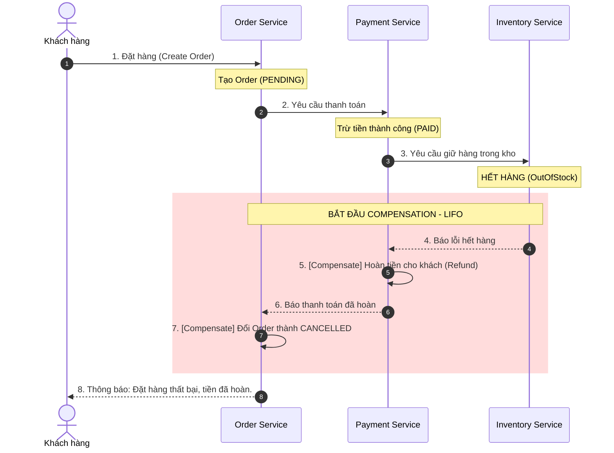

## 1. Sequence Diagram




## 2. Pseudo-code mô phỏng Saga (Orchestration)

```java
// SAGA ORCHESTRATOR: Điều phối toàn bộ quy trình đặt hàng
class OrderSagaOrchestrator {

    function executeOrderSaga(orderId, customerId, amount, items, address) {
        
        // BƯỚC 1: TẠO ĐƠN HÀNG (PENDING)
        try {
            OrderService.createOrder(orderId, items);
        } catch (Exception e) {
            return "Đặt hàng thất bại.";
        }

        // BƯỚC 2: TRỪ TIỀN (PAYMENT)
        try {
            PaymentService.charge(customerId, amount);
        } catch (PaymentException e) {
            OrderService.cancelOrder(orderId); // Bù trừ bước 1
            return "Thanh toán thất bại -> Đã hủy đơn hàng.";
        }

        // BƯỚC 3: GIỮ HÀNG TRONG KHO (INVENTORY)
        try {
            InventoryService.reserve(items);
        } catch (OutOfStockException e) {
            // Hết hàng -> COMPENSATION LIFO: Bước 2 -> Bước 1
            PaymentService.refund(customerId, amount); // 1. Hoàn tiền
            OrderService.cancelOrder(orderId);         // 2. Hủy đơn
            return "Kho hết hàng -> Đã hoàn lại tiền và hủy đơn hàng.";
        }

        // BƯỚC 4: TẠO VẬN ĐƠN (SHIPPING)
        try {
            ShippingService.createShipment(orderId, address);
        } catch (ShippingException e) {
            // Lỗi giao hàng -> COMPENSATION LIFO: Bước 3 -> Bước 2 -> Bước 1
            InventoryService.release(items);           // 1. Nhả hàng
            PaymentService.refund(customerId, amount); // 2. Hoàn tiền
            OrderService.cancelOrder(orderId);         // 3. Hủy đơn
            return "Vận chuyển thất bại -> Đã nhả hàng, hoàn tiền và hủy đơn.";
        }

        // TẤT CẢ THÀNH CÔNG
        OrderService.markSuccess(orderId);
        return "Saga thành công! Đơn hàng đã sẵn sàng giao.";
    }
}
```

---

## 4. Phân tích so sánh Choreography vs Orchestration

### So sánh nhanh

| Tiêu chí | **Choreography ** | **Orchestration ** |
| :--- | :--- | :--- |
| **Cách hoạt động** | Các service tự bắn và lắng nghe Event của nhau qua Message Queue. | Có 1 `Orchestrator` trung tâm gửi lệnh (Command) chỉ định từng service. |
| **Độ phụ thuộc (Coupling)** | Rất thấp (Loose coupling). | Cao hơn (Tight coupling với Orchestrator). |
| **Độ rõ ràng của luồng** | Mơ hồ, khó nhìn thấy toàn bộ flow. | Rõ ràng, mở file Orchestrator là thấy toàn bộ quy trình. |
| **Khả năng Debug & Test** | Khó, dễ bị vòng lặp sự kiện (Circular dependency). | Dễ trace log, dễ viết Unit Test mock từng service. |
| **Phù hợp nhất khi** | Quy trình ngắn (**2 - 3 services**). | Quy trình phức tạp (**từ 4 services trở lên**). |

### Lựa chọn triển khai và giải thích lý do
* **Phương án lựa chọn:** **Saga Orchestration**.
* **Lý do:**
  1. Quy trình gồm **4 services** (`Order` $\rightarrow$ `Payment` $\rightarrow$ `Inventory` $\rightarrow$ `Shipping`), nếu dùng Choreography thì số lượng Event lắng nghe chéo nhau rất phức tạp, dễ gây lỗi và khó kiểm soát.
  2. Orchestration giúp gom toàn bộ logic hoàn nguyên (*Compensation*) về một nơi duy nhất theo đúng thứ tự **LIFO**, đảm bảo việc hoàn tiền và trả hàng về kho không bị sót hoặc sai thứ tự.
  3. Dễ dàng lưu log trạng thái (*State Machine*) để hiển thị tiến độ đơn hàng cho khách hàng theo thời gian thực.
