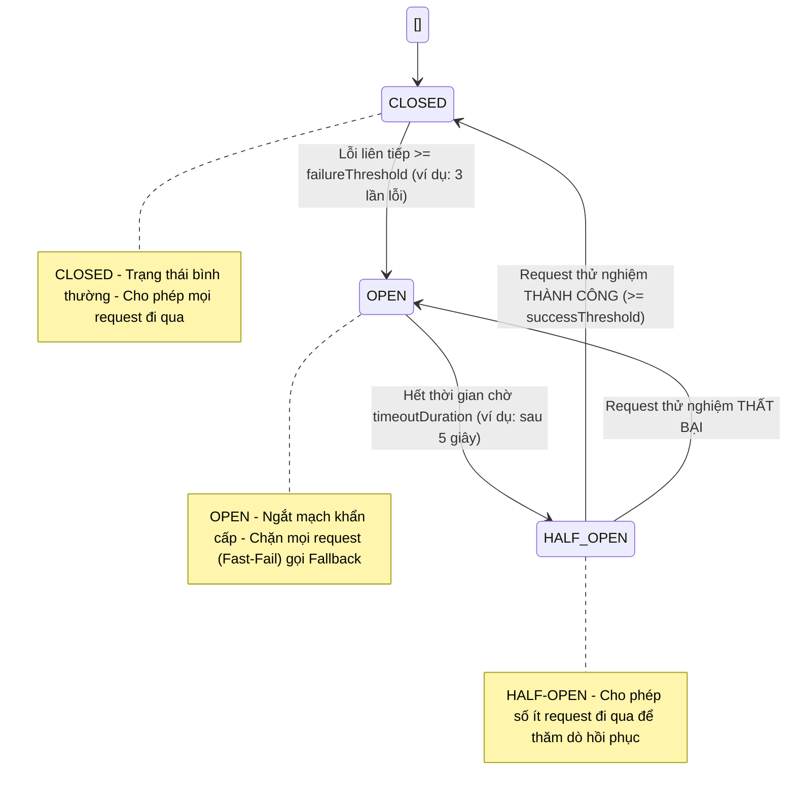

## 1. State Diagram (Sơ đồ chuyển trạng thái)



---

## 2. Bảng cấu hình các thông số (Configuration)

| Thông số | Giá trị đề xuất | Ý nghĩa nghiệp vụ |
| :--- | :---: | :--- |
| Failure Threshold | `3` (lỗi liên tiếp) | Nếu gọi Payment Service thất bại 3 lần liên tiếp, lập tức ngắt mạch sang `OPEN`. |
| Timeout Duration | `5000` ms (5 giây) | Khoảng thời gian mạch ở trạng thái `OPEN` trước khi chuyển sang `HALF-OPEN` để thử lại. |
| Success Threshold | `2` (lần thành công) | Số lần request thành công liên tiếp ở `HALF-OPEN` để xác nhận service đã khỏe mạnh và đóng mạch về `CLOSED`. |
| Retry Count | `2` lần | Số lần thử lại tối đa cho các lỗi mạng ngắn hạn (Transient Error) trước khi tính là 1 lần failure cho Circuit Breaker. |
| Fallback Behavior | `Graceful Failure` | Trả về thông báo lỗi thân thiện cho người dùng kèm mã giao dịch chờ xử lý lại, tuyệt đối không quăng mã lỗi 500 làm sập UI. |

---

## 3. Code Java mô phỏng hoàn chỉnh (Payment Circuit Breaker)

Code mô phỏng    chu trình: Thành công -> Lỗi liên tiếp -> OPEN (Fast Fail) -> Chờ timeout -> HALF-OPEN -> CLOSED.

```java
import java.time.Instant;

public class PaymentCircuitBreakerDemo {

    public enum State {
        CLOSED,     // Bình thường
        OPEN,       // Ngắt mạch
        HALF_OPEN   // Thăm dò hồi phục
    }

    // --- CẤU HÌNH ---
    private final int failureThreshold = 3;           // 3 lần lỗi liên tiếp -> Mở mạch
    private final int successThreshold = 2;           // 2 lần thành công liên tiếp ở HALF_OPEN -> Đóng mạch
    private final long timeoutDurationMs = 5000;      // 5 giây chờ ở trạng thái OPEN

    // --- TRẠNG THÁI HIỆN TẠI ---
    private State state = State.CLOSED;
    private int failureCount = 0;
    private int successCount = 0;
    private long lastStateChangedTime = System.currentTimeMillis();

    // Biến giả lập lỗi của Payment Service
    public static boolean isPaymentServiceDown = false;

    /
      Hàm gọi thanh toán được bọc qua Circuit Breaker
     /
    public String processPayment(String orderId, double amount) {
        long now = System.currentTimeMillis();

        // 1. Kiểm tra nếu đang OPEN và đã hết thời gian chờ -> Chuyển sang HALF-OPEN
        if (state == State.OPEN) {
            if (now - lastStateChangedTime >= timeoutDurationMs) {
                state = State.HALF_OPEN;
                successCount = 0;
                lastStateChangedTime = now;
                System.out.println("\n🔄 [TIMEOUT EXPIRED] -> Chuyển sang HALF-OPEN để thăm dò...");
            } else {
                // Đang trong thời gian OPEN -> Fast Fail, gọi Fallback ngay lập tức!
                return executeFallback(orderId, "Mạch đang OPEN (Dịch vụ thanh toán đang gián đoạn).");
            }
        }

        // 2. Thực hiện gọi sang Payment Service
        try {
            String result = callRemotePaymentService(orderId, amount);
            onSuccess();
            return result;
        } catch (Exception e) {
            onFailure(e.getMessage());
            return executeFallback(orderId, e.getMessage());
        }
    }

    private void onSuccess() {
        if (state == State.HALF_OPEN) {
            successCount++;
            System.out.println("Thử nghiệm HALF-OPEN thành công (" + successCount + "/" + successThreshold + ")");
            if (successCount >= successThreshold) {
                state = State.CLOSED;
                failureCount = 0;
                successCount = 0;
                System.out.println(" [PHỤC HỒI HOÀN TOÀN] -> Đóng mạch (CLOSED) trở lại bình thường!");
            }
        } else if (state == State.CLOSED) {
            failureCount = 0; // Reset số lỗi khi có giao dịch thành công
        }
    }

    private void onFailure(String errorMsg) {
        if (state == State.HALF_OPEN) {
            // Đang thăm dò mà vẫn lỗi -> Lập tức quay lại OPEN
            state = State.OPEN;
            lastStateChangedTime = System.currentTimeMillis();
            successCount = 0;
            System.out.println(" Thử nghiệm thất bại -> MỞ LẠI MẠCH (OPEN)! Tiếp tục chờ 5s...");
        } else if (state == State.CLOSED) {
            failureCount++;
            System.out.println(" Giao dịch lỗi: " + errorMsg + " (Lỗi liên tiếp: " + failureCount + "/" + failureThreshold + ")");
            if (failureCount >= failureThreshold) {
                state = State.OPEN;
                lastStateChangedTime = System.currentTimeMillis();
                System.out.println(" [ĐẠT NGƯỠNG LỖI] -> NGẮT MẠCH (OPEN)! Chặn toàn bộ request kế tiếp.");
            }
        }
    }

    /
      Giả lập service thanh toán
     /
    private String callRemotePaymentService(String orderId, double amount) throws Exception {
        if (isPaymentServiceDown) {
            // Giả lập timeout hoặc sập server
            throw new RuntimeException("Payment Gateway Timeout (504)");
        }
        return "SUCCESS: Đã thanh toán " + amount + "$ cho đơn " + orderId;
    }

    /
      Fallback có ý nghĩa cho người dùng
     /
    private String executeFallback(String orderId, String reason) {
        return "[FALLBACK] Đơn hàng " + orderId + " đã được ghi nhận. Cổng thanh toán đang bảo trì, vui lòng hoàn tất thanh toán sau. (Lý do: " + reason + ")";
    }

    // ========================================================
    // KỊCH BẢN CHẠY TEST THỰC TẾ
    // ========================================================
    public static void main(String[] args) throws InterruptedException {
        PaymentCircuitBreakerDemo cb = new PaymentCircuitBreakerDemo();

        System.out.println("=== 1. TRẠNG THÁI BÌNH THƯỜNG (CLOSED) ===");
        System.out.println(cb.processPayment("ORD_01", 100));

        System.out.println("\n=== 2. PAYMENT SERVICE BỊ SẬP -> LỖI LIÊN TIẾP ===");
        isPaymentServiceDown = true;
        System.out.println(cb.processPayment("ORD_02", 50));
        System.out.println(cb.processPayment("ORD_03", 70));
        System.out.println(cb.processPayment("ORD_04", 120)); // Đạt threshold 3 -> Sang OPEN

        System.out.println("\n=== 3. MẠCH ĐANG OPEN -> FAST-FAIL NGAY LẬP TỨC (KHÔNG GỌI SERVICE) ===");
        System.out.println(cb.processPayment("ORD_05", 200));

        System.out.println("\n=== 4. CHỜ 5 GIÂY CHO HẾT THỜI GIAN TIMEOUT... ===");
        Thread.sleep(5100);

        System.out.println("\n=== 5. CHUYỂN SANG HALF-OPEN: THỬ NGHIỆM KHI SERVICE ĐÃ KHỎE LẠI ===");
        isPaymentServiceDown = false; // Service đã sống lại
        System.out.println(cb.processPayment("ORD_06", 80));  // Test 1
        System.out.println(cb.processPayment("ORD_07", 90));  // Test 2 -> Đủ 2 lần -> Sang CLOSED

        System.out.println("\n=== 6. MẠCH ĐÃ VỀ CLOSED HOÀN TOÀN ===");
        System.out.println(cb.processPayment("ORD_08", 150));
    }
}
```

---

## 4. Phân tích tiêu chí hoàn thành bài học

### 1. Phân biệt Retry vs Circuit Breaker
Retry: Dùng để thử lại ngay khi gặp các lỗi mạng thoáng qua (Transient Error như chập chờn kết nối, socket timeout ngắn). Giả định rằng lần gọi kế tiếp sẽ thành công.
Circuit Breaker: Dùng để chủ động dừng gọi một dependency khi nó đã chết hẳn hoặc quá tải trong thời gian dài. Thay vì chờ đợi trong vô vọng, nó ngắt mạch để giải phóng tài nguyên.

### 2. Tại sao Retry sai cách có thể làm hệ thống quá tải hơn?
Khi service đích đang bị quá tải (CPU 100%, hàng nghìn request đang nghẽn), nếu các service gọi đến tiếp tục Retry liên tục và mù quáng, lượng request dồn đến sẽ tăng theo cấp số nhân (Thundering Herd problem).
Vô tình, cơ chế Retry biến client thành một cuộc tấn công tự DDoS vào chính hệ thống nội bộ của mình, khiến service không bao giờ có cơ hội hồi phục.

### 3. Ý nghĩa của Fallback có ý nghĩa (Meaningful Fallback)
Thay vì để lộ lỗi kỹ thuật (`NullPointerException`, `504 Gateway Timeout`) làm sập giao diện người dùng:
- Graceful Degradation: Cho phép hệ thống tiếp tục hoạt động một phần (ví dụ: tạo đơn trước, thanh toán sau; hoặc lấy thông tin từ Cache cũ).
- Trải nghiệm người dùng: Thông báo rõ ràng lý do và hướng dẫn giải pháp thay thế thân thiện.
