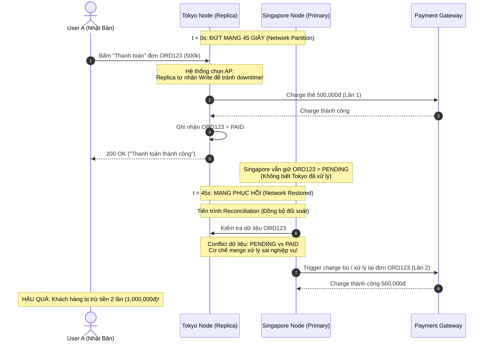

# Assignment 1: Tại sao khách hàng thấy đơn hàng bị mất tiền 2 lần?

**Topics áp dụng:** CAP Theorem, PACELC

## **1. Đề bài thực tế**

`Bối cảnh:
Hệ thống Order Service có 1 Database Primary ở Region A (Singapore)
và 1 Replica ở Region B (Tokyo) để phục vụ đọc cho user Nhật.

Sự cố xảy ra lúc 2h sáng:
- Network giữa Singapore và Tokyo bị đứt 45 giây (network partition).
- Trong 45 giây đó:
  + User A (đang connect vào Tokyo) bấm "Thanh toán" cho đơn hàng ORD123.
  + Request được xử lý bởi Replica Tokyo (vì lúc đó hệ thống cho phép
    replica tạm thời nhận write khi mất kết nối với Primary, để tránh
    downtime - đây là quyết định kiến trúc có sẵn).
  + Payment được ghi nhận: Order ORD123 = PAID, charge thẻ 500,000đ.

- Sau 45s, network được khôi phục.
- Primary ở Singapore VẪN CÒN dữ liệu cũ: ORD123 = PENDING
  (vì Primary không biết Tokyo đã tự xử lý request trong lúc partition).
- Khi 2 node đồng bộ lại (reconciliation), do conflict giữa 2 bản ghi,
  hệ thống merge sai và tạo ra 2 lần charge cho cùng 1 đơn hàng.

Hậu quả: Khách hàng bị trừ tiền 2 lần, phải hoàn tiền, viết báo cáo
incident cho leadership.`

## **2. Câu hỏi**

`Q1: "Theo các bạn, khi network partition xảy ra, hệ thống này đã ưu 
    tiên C hay A? Vì sao các bạn biết?"

Q2: "Nếu là các bạn thiết kế hệ thống Order/Payment này, các bạn sẽ 
    chọn CP hay AP? Tại sao?"

Q3: "Giả sử ta chọn CP (từ chối request khi partition). Trải nghiệm 
    user sẽ như thế nào? Có chấp nhận được không?"

Q4: "Có cách nào vừa tránh mất tiền, vừa không làm user chờ đợi quá 
    lâu không?" (Gợi ý: idempotency key, không phải mọi thứ đều 
    all-or-nothing)

Q5: "Loại dữ liệu nào trong hệ thống E-commerce có thể chấp nhận AP? 
    Cho ví dụ cụ thể."`

## **3. Thông tin thêm**

**CAP Theorem:**

- Hệ thống đã chọn **Availability (A)** khi partition xảy ra: cho phép Tokyo tự xử lý write thay vì từ chối request.
- Đây chính là **AP system**: hy sinh Consistency để giữ Availability.
- Vấn đề: **Payment là loại dữ liệu cần Consistency (CP), không nên là AP.**

**PACELC:**

- Ngay cả khi không có partition, câu hỏi vẫn còn: giữa latency thấp (cho phép ghi ở gần user Nhật) và consistency mạnh (chỉ ghi ở primary), hệ thống đã chọn sai ưu tiên cho loại dữ liệu payment.

## **4. Yêu cầu:**

- trả lời và đưa ra cách hiểu và xử lý bài toán vào file .md

---

## 5. Giải quyết bài tập

### Q1: Phân tích ưu tiên C hay A khi network partition xảy ra

Khi network partition xảy ra, hệ thống này đã ưu tiên Availability (A) (là hệ thống AP).

Dấu hiệu nhận biết:
1. Khi đường truyền mạng giữa Singapore và Tokyo bị đứt hoàn toàn trong 45 giây, Replica ở Tokyo không từ chối request mà vẫn tiếp tục chấp nhận thao tác ghi thanh toán từ User A và phản hồi thành công. Theo định nghĩa CAP, Availability có nghĩa là: *"Mọi node không bị lỗi (non-failing node) đều phải trả về phản hồi thành công (non-error response) cho mọi request nhận được"*.
2. Để giữ tính sẵn sàng (Availability), hệ thống chấp nhận đánh đổi tính nhất quán (Consistency): Dữ liệu tại Tokyo ghi nhận `ORD123 = PAID` (đã charge thẻ lần 1), trong khi Primary tại Singapore vẫn giữ nguyên `ORD123 = PENDING`.
3. Hiện tượng này dẫn đến tình trạng Split-Brain: Hai node hoạt động biệt lập với hai trạng thái đối nghịch nhau. Khi mạng phục hồi, quá trình đồng bộ (reconciliation) không giải quyết được xung đột (conflict resolution) và dẫn đến hậu quả trừ tiền 2 lần.

#### Sequence Diagram mô phỏng sự cố:

---

### Q2: Lựa chọn giữa CP hay AP cho hệ thống Order/Payment

Nếu thiết kế hệ thống Order/Payment, bắt buộc phải chọn CP (Consistency & Partition Tolerance).

Lý do:
1. Bản chất của dữ liệu tài chính (Financial Invariants): Tiền bạc, tài khoản ngân hàng và thẻ tín dụng có quy tắc nghiệp vụ bất biến nghiêm ngặt: *Một đơn hàng chỉ được phép trừ tiền đúng một lần*. Sai sót về tiền bạc gây thiệt hại tài chính trực tiếp và vi phạm pháp lý.
2. Chi phí của Inconsistency lớn hơn rất nhiều chi phí Downtime:
   - Nếu chọn AP: Khi đứt mạng, hệ thống cố chấp nhận ghi $\rightarrow$ Dữ liệu bị phân mảnh, trừ tiền trùng lặp, sai lệch báo cáo kế toán, phải hoàn tiền thủ công, tổn hại uy tín thương hiệu nghiêm trọng.
   - Nếu chọn CP: Khi đứt mạng, hệ thống từ chối thanh toán một cách an toàn trong 45s $\rightarrow$ Không có ai bị mất tiền oan, dữ liệu toàn vẹn 100%.
3. Nguyên tắc Single Leader: Dữ liệu thanh toán bắt buộc phải được tuần tự hóa (serialized) qua một nút Primary duy nhất để đảm bảo tính ACID. Tuyệt đối không cho phép các Replica tự ý nhận write khi bị cô lập khỏi Primary.

---

### Q3: Trải nghiệm người dùng khi chọn CP và tính chấp nhận được

1. Trải nghiệm của user khi chọn CP:
   - Khi mạng bị partition, User A bấm "Thanh toán", hệ thống Tokyo nhận thấy không thể liên lạc với Primary Singapore để đảm bảo Quorum $\rightarrow$ Hệ thống lập tức trả về lỗi rõ ràng và có kiểm soát (Fast-fail): *"Cổng thanh toán đang bảo trì hoặc gián đoạn kết nối tạm thời. Đơn hàng của bạn vẫn được lưu. Vui lòng thử lại sau giây lát."*
   - Tài khoản của user hoàn toàn không bị trừ tiền.
2. Có chấp nhận được không?
   - Hoàn toàn chấp nhận được: Người dùng thương mại điện tử rất quen thuộc và thông cảm với việc một giao dịch thanh toán thất bại tạm thời do mạng và sẵn sàng bấm thử lại sau 1-2 phút.
   - Ngược lại, điều người dùng tuyệt đối không chấp nhận là hệ thống báo thành công hoặc lỗi mập mờ nhưng tài khoản lại bị trừ tiền 2 lần, sau đó phải mất 7-14 ngày làm việc chờ khiếu nại hoàn tiền từ ngân hàng.

---

### Q4: Giải pháp tối ưu: Tránh mất tiền và không làm user chờ đợi lâu

Để vừa đảm bảo an toàn tiền bạc, vừa tối ưu trải nghiệm và không bắt user chờ đợi vô vọng, áp dụng kết hợp các giải pháp sau:

1. Sử dụng Idempotency Key:
   - Phía Client tạo một mã `Idempotency-Key` duy nhất (ví dụ UUID gắn với `orderId`: `IDEMP-ORD123-ATTEMPT-1`) trước khi gửi request thanh toán.
   - Payment Service và Payment Gateway (Stripe, VNPay, ZaloPay) lưu key này lại. Nếu request bị gửi lặp lại do retry hoặc mạng chập chờn, Payment Gateway phát hiện trùng key và trả về ngay kết quả của lần xử lý trước đó mà không bao giờ charge thẻ lần 2.
2. Xử lý bất đồng bộ qua Message Queue bền vững (Asynchronous Processing):
   - Thay vì bắt user chờ kết nối đồng bộ xuyên lục địa (Singapore $\leftrightarrow$ Tokyo), hệ thống ghi nhận yêu cầu vào Message Queue có cơ chế phân tán bền vững (như Apache Kafka với `acks=all`).
   - Phản hồi ngay cho user: *"Yêu cầu thanh toán của bạn đang được xử lý, kết quả sẽ được cập nhật trong ít phút"*. Worker sẽ lấy message ra xử lý tuần tự khi kết nối ổn định.
3. Áp dụng mô hình Authorize & Capture (Hai bước thanh toán):
   - Bước 1 (Authorize): Tạm giữ hạn mức tiền trên thẻ của user (thao tác nhanh, chưa thực sự chuyển tiền).
   - Bước 2 (Capture): Chỉ khi Primary DB tại Singapore xác nhận đơn hàng hợp lệ và trừ tồn kho thành công thì hệ thống mới gửi lệnh Capture để trừ tiền thật. Nếu có sự cố, lệnh Authorize sẽ tự động hủy mà không cần làm thủ tục hoàn tiền (Refund).
4. Circuit Breaker ngắt mạch nhanh (Fast-fail):
   - Thiết lập Circuit Breaker giám sát đường truyền giữa Tokyo và Singapore. Khi phát hiện timeout liên tiếp, ngắt mạch ngay lập tức (OPEN) để trả lỗi cho user chỉ trong vài mili-giây thay vì để trình duyệt xoay vòng chờ 30-45 giây rồi mới báo lỗi.

---

### Q5: Phân loại dữ liệu trong E-commerce theo CAP

Trong một hệ thống E-commerce, kiến trúc chuẩn là kết hợp cả CP và AP cho từng nhóm nghiệp vụ riêng biệt:

| Nhóm dữ liệu | Mô hình CAP | Ví dụ cụ thể trong E-commerce | Lý do lựa chọn |
| :--- | :---: | :--- | :--- |
| Thanh toán & Số dư ví | CP | - Trừ tiền thẻ tín dụng - Số dư ví điện tử - Áp dụng mã Voucher giảm giá 1 lần | Bắt buộc đảm bảo tính toàn vẹn tài chính, sai lệch tiền bạc gây hậu quả pháp lý nghiêm trọng. |
| Quản lý tồn kho mở bán | CP | - Số lượng tồn kho sản phẩm trong khung giờ Flash Sale số lượng có hạn | Tránh tình trạng Overselling (bán quá số lượng tồn kho thực tế), gây hủy đơn hàng loạt. |
| Lượt xem & Thống kê | AP | - Số lượt xem sản phẩm (Product View Count) - Lượt click banner quảng cáo | Chênh lệch một vài lượt xem giữa các vùng không ảnh hưởng đến kinh doanh; ưu tiên phản hồi cực nhanh. |
| Đánh giá & Bình luận | AP | - User gửi Review, Vote 5 sao sản phẩm - Đặt câu hỏi hỏi đáp về sản phẩm | Bình luận xuất hiện chậm 5-10 giây trên các Region khác là hoàn toàn chấp nhận được (Eventual Consistency). |
| Giỏ hàng tạm thời | AP | - Thêm/bớt sản phẩm vào giỏ hàng của khách vãng lai | Cần Availability tuyệt đối để khách mua sắm mượt mà; dữ liệu giỏ hàng có thể merge lại sau khi mạng thông suốt. |
| Thông tin Catalog sản phẩm | AP | - Tên sản phẩm, mô tả, thông số kỹ thuật, hình ảnh | Dữ liệu ít thay đổi, đọc từ Cache/Replica gần user nhất (Tokyo) để tối ưu tốc độ tải trang. |
