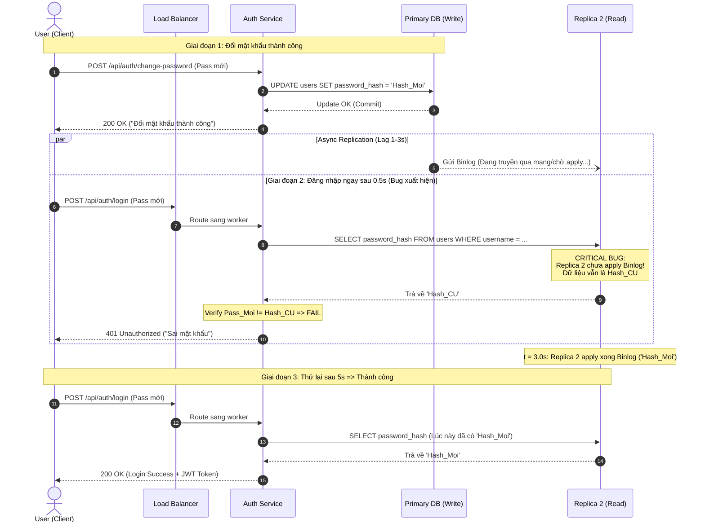

# Assignment 2: Vì sao user vừa đổi mật khẩu xong lại đăng nhập không được?

**Topics áp dụng:** Consistency Models (Read-your-writes, Eventual Consistency), Database Replication

## **1. Đề bài thực tế**

`Bối cảnh:
Hệ thống Authentication Service dùng kiến trúc:
- 1 Primary DB (nhận toàn bộ write).
- 3 Read Replicas (phục vụ read, mỗi replica handle ~30% traffic
  qua load balancer round-robin).
- Replication là ASYNCHRONOUS (để giảm latency cho các API đọc).

Complaint từ user:
"Tôi vừa đổi mật khẩu xong, bấm đăng nhập lại ngay bằng mật khẩu 
mới thì hệ thống báo 'Sai mật khẩu'. Tôi phải thử lại sau 5 giây 
mới đăng nhập được."

Debug team phát hiện:
- Request "Đổi mật khẩu" → ghi vào Primary → trả response "Thành công".
- Request "Đăng nhập" (ngay sau đó, 0.5 giây) → được load balancer 
  route sang Replica 2.
- Replica 2 CHƯA kịp nhận bản update mật khẩu mới (replication lag
  trung bình 1-3 giây).
- Replica 2 check password bằng bản ghi CŨ → FAIL.`

## **2. Câu hỏi**

`Q1: "Ai có thể vẽ lại flow của bug này trên bảng/giấy, chỉ ra chính 
    xác bước nào gây ra vấn đề?"

Q2: "Đây là lỗi ở tầng nào: Application code, Database, hay 
    Architecture design? Giải thích."

Q3: "Consistency model nào đang bị vi phạm ở đây? Có phải hệ thống 
    'sai' không, hay đây là trade-off đã biết trước của async 
    replication?"

Q4: "Nếu bạn là Tech Lead, bạn đề xuất bao nhiêu giải pháp để fix? 
    Liệt kê ít nhất 3, so sánh ưu nhược điểm."

Q5: "Giải pháp nào các bạn chọn cho production, và đánh đổi (trade-off) 
    của nó là gì?"`

## **3. Lý thuyết**

**Consistency Models:**

- Đây là vi phạm **Read-your-writes consistency**: user vừa ghi (đổi password) phải đọc lại được chính write đó ngay lập tức, nhưng hệ thống không đảm bảo điều này.
- Đây là hệ quả tự nhiên của **Eventual Consistency** trong replication bất đồng bộ.

**Database Replication:**

- Read routing đang áp dụng round-robin mù quáng, không phân biệt loại request nào cần đọc từ Primary (data mới nhất) và loại nào có thể đọc từ Replica (chấp nhận stale).
- Đây chính là vấn đề "read scaling nhưng thiếu routing strategy hợp lý".

## **4. Yêu cầu:**

- trả lời và đưa ra cách hiểu và xử lý bài toán vào file .md

---

## 5. Giải quyết bài tập

### Q1: Vẽ lại flow của bug và chỉ ra chính xác bước gây ra vấn đề

#### Trình tự các mốc thời gian ($t_0 \rightarrow t_6$):
- $t_0 = 0.0s$: User gửi request `POST /api/auth/change-password` (Pass cũ $\rightarrow$ Pass mới).
- $t_1 = 0.1s$: Auth Service ghi Pass mới vào Primary DB. Primary DB ghi Write-Ahead Log (WAL/Binlog), commit dữ liệu và phản hồi `200 OK - Đổi mật khẩu thành công`.
- $t_2 = 0.1s \rightarrow 2.5s$: Primary DB đẩy Binlog sang các Replicas qua tiến trình mạng bất đồng bộ (Asynchronous Replication). Tuy nhiên, do mạng hoặc hàng đợi I/O tại các Replica, xuất hiện độ trễ Replication Lag (trung bình 1–3s).
- $t_3 = 0.6s$ (chỉ 0.5s sau khi đổi pass): User lập tức bấm `POST /api/auth/login` bằng Pass mới.
- $t_4 = 0.7s$: Load Balancer điều phối request đăng nhập sang Replica 2 theo thuật toán Round-Robin.
- $t_5 = 0.8s$ (BƯỚC GÂY LỖI CHÍNH XÁC): Replica 2 thực hiện truy vấn `SELECT password_hash FROM users WHERE username = ?`. Do chưa nhận hoặc chưa áp dụng xong Binlog cập nhật từ Primary ($t_5 < t_{\text{sync}}$), Replica 2 trả về Password Hash CŨ. Auth Service so khớp Pass mới với Hash cũ $\rightarrow$ Không khớp $\rightarrow$ Trả về mã lỗi `401 Unauthorized` ("Sai mật khẩu").
- $t_6 = 3.0s$: Replica 2 hoàn tất đồng bộ Binlog từ Primary (Mật khẩu mới đã có hiệu lực trên Replica 2). Lúc này user thử lại sau 5s thì đăng nhập thành công.

#### Sequence Diagram mô phỏng sự cố:



---

### Q2: Đây là lỗi ở tầng nào: Application code, Database, hay Architecture design? Giải thích.

Kết luận: Đây là lỗi ở tầng Architecture Design (Thiết kế kiến trúc), cụ thể là chiến lược định tuyến đọc/ghi (Read/Write Routing Strategy) thiếu nhận thức về ngữ cảnh nghiệp vụ (Context-unaware Routing).

- Database KHÔNG có lỗi:
  - Database được cấu hình cơ chế *Asynchronous Replication* để ưu tiên tối đa thông lượng ghi (Write throughput) và giảm thiểu độ trễ cho client.
  - Việc tồn tại một khoảng thời gian trễ đồng bộ (*Replication Lag*) từ vài trăm mili-giây đến vài giây là đặc tính tự nhiên theo thiết kế (by design) của cơ chế sao chép bất đồng bộ, hoàn toàn không phải do DB bị lỗi hay crash.
- Application Code KHÔNG sai logic thuật toán:
  - Logic xác thực (`BCrypt.checkpw(plainPassword, storedHash)`) thực hiện chuẩn xác: nhận được hash nào từ DB thì so sánh đúng với hash đó.
- Tầng Architecture Design chịu trách nhiệm hoàn toàn vì 2 khiếm khuyết:
  1. Áp dụng Round-Robin mù quáng (Blind Load Balancing): Hệ thống đối xử với mọi câu lệnh `SELECT` như nhau, coi việc "đọc thông tin cá nhân" ngang hàng với việc "đọc thông tin bảo mật để xác thực danh tính", chia đều cho 3 Replicas mà không phân biệt mức độ nhạy cảm của dữ liệu.
  2. Thiếu cơ chế bảo đảm tính nhất quán sau khi ghi (Read-Your-Writes Guarantees): Khi thiết kế một hệ thống phân tán sử dụng Replication bất đồng bộ, kiến trúc sư bắt buộc phải lường trước tình huống người dùng thực hiện một chuỗi thao tác liên tiếp (*Write $\rightarrow$ Read ngay lập tức*) và phải có giải pháp định tuyến hoặc lưu trữ phiên làm việc tương ứng.

---

### Q3: Consistency model nào đang bị vi phạm ở đây? Có phải hệ thống "sai" không, hay đây là trade-off đã biết trước của async replication?

1. Mô hình nhất quán bị vi phạm:
   - Hệ thống vi phạm mô hình Read-Your-Writes Consistency (hay *Read-After-Write Consistency*).
   - *Định nghĩa:* Nếu một Actor thực hiện một hành động cập nhật dữ liệu ($W$), thì mọi hành động đọc ($R$) tiếp theo của chính Actor đó phải luôn nhìn thấy giá trị mới $W$ vừa cập nhật (hoặc một phiên bản mới hơn), không bao giờ nhìn thấy giá trị cũ.
   - Trong tình huống này: User vừa thực hiện Write (đổi mật khẩu mới), nhưng thao tác Read ngay sau đó của chính User (đăng nhập) lại đọc phải bản ghi mật khẩu cũ từ Replica 2.

2. Hệ thống có "sai" không?
   - Về mặt kỹ thuật lý thuyết phân tán: Hệ thống không sai. Đây là hệ quả hiển nhiên của mô hình Eventual Consistency trong Asynchronous Replication. Hệ thống chỉ cam kết dữ liệu *cuối cùng sẽ nhất quán* (eventual), không cam kết *ngay lập tức nhất quán* tại mọi thời điểm $t$.
   - Về mặt nghiệp vụ & Trải nghiệm người dùng (UX / Security): Hệ thống SAI NGHIÊM TRỌNG. Đối với nghiệp vụ cốt lõi như Xác thực & Phân quyền (Authentication / Authorization), tính đúng đắn và độ tin cậy là tuyệt đối. Việc thông báo "Sai mật khẩu" cho mật khẩu người dùng vừa đổi cách đó nửa giây là một lỗi trải nghiệm làm mất lòng tin của khách hàng và làm tăng gánh nặng cho bộ phận Chăm sóc khách hàng (CSKH / Helpdesk).

---

### Q4: Đề xuất các giải pháp khả thi (Góc nhìn Tech Lead)

Dưới đây là 4 giải pháp xử lý triệt để bài toán kèm phân tích ưu/nhược điểm:

| Giải pháp | Cơ chế hoạt động | Ưu điểm | Nhược điểm |
| :--- | :--- | :--- | :--- |
| Giải pháp 1: Route mọi request Authentication về Primary DB | Tách riêng DataSource: Mọi query xác thực (`SELECT password_hash FROM users WHERE username = ?`) luôn luôn được định tuyến trực tiếp về Primary DB. Các query đọc thông tin profile, avatar, lịch sử đọc từ Replicas. | - Khắc phục 100% bug.<br/>- Đạt Strong Consistency tuyệt đối cho Auth.<br/>- Dễ cài đặt nhất (cấu hình trong code/ORM). | - Tăng tải đọc lên Primary DB.<br/>- Nếu lượng user đăng nhập đồng thời cực lớn (Flash sale), Primary chịu thêm áp lực kết nối. |
| Giải pháp 2: Time-window Routing (Pin to Primary / Sticky Routing sau khi Write) | Khi user đổi pass thành công, server đặt 1 flag trên Redis (`user:recent_pwd_change:<userId>`, TTL = 10s) hoặc gửi kèm Cookie/Header. Trong vòng 10s, mọi request đọc của user này được ép route về Primary. Sau 10s, route lại Replicas. | - Đảm bảo trọn vẹn Read-Your-Writes.<br/>- 99% user khác đăng nhập bình thường vẫn đọc từ Replicas $\rightarrow$ Bảo vệ Primary không bị quá tải. | - Tăng độ phức tạp kiến trúc (cần Redis hoặc Cookie validation).<br/>- Cần xử lý trường hợp user đổi trình duyệt / thiết bị trong 0.5s (dùng Redis key theo username sẽ an toàn hơn Cookie). |
| Giải pháp 3: Tự động đăng nhập & trả JWT Token ngay sau khi đổi mật khẩu | Thay vì bắt user đăng nhập lại: Khi đổi mật khẩu thành công trên Primary, Auth Service tạo luôn Access Token & Refresh Token mới và trả về trong response body. Client lưu token và chuyển thẳng vào Home/Dashboard. | - UX mượt mà, người dùng không phải gõ lại mật khẩu.<br/>- Triệt tiêu hoàn toàn request đọc mật khẩu ngay sau khi ghi. | - Không giải quyết được nếu user chủ động mở tab mới / thiết bị khác để login ngay.<br/>- Vẫn cần kết hợp Giải pháp 1 hoặc 2 làm chốt chặn kỹ thuật. |
| Giải pháp 4: Chuyển sang Semi-Synchronous Replication cho Database | Cấu hình DB Primary chỉ commit giao dịch khi có ít nhất 1 Replica nhận và ghi log thành công vào Relay Log. | - Dữ liệu luôn có sẵn trên ít nhất 1 Replica, giảm thiểu tối đa replication lag. | - Tăng Write Latency của toàn bộ hệ thống.<br/>- Không đảm bảo 100% nếu Load Balancer route trúng Replica thứ 2 hoặc 3 (nơi chưa kịp apply log). Quá phức tạp và không trúng đích. |

---

### Q5: Giải pháp lựa chọn cho Production và phân tích Trade-off

#### Lựa chọn triển khai thực tế trên Production:
Áp dụng Chiến lược kết hợp đa tầng: Giải pháp 3 (Tầng UX / Application) + Giải pháp 1 (Tầng Data Architecture Routing).

1. Ở tầng UX / Flow nghiệp vụ (Giải pháp 3):
   - Ngay khi API `POST /api/auth/change-password` hoàn tất cập nhật trên Primary DB, Auth Service tạo ngay cặp `JWT Access Token & Refresh Token` mới và trả về client.
   - Giao diện Frontend tự động lưu token và hiển thị thông báo: *"Đổi mật khẩu thành công! Hệ thống đã tự động gia hạn phiên đăng nhập của bạn."* $\rightarrow$ Loại bỏ 95% nhu cầu người dùng phải gõ lại mật khẩu ngay lập tức.
2. Ở tầng Kiến trúc định tuyến dữ liệu (Giải pháp 1):
   - Đối với tất cả các thao tác xác thực mật khẩu khi đăng nhập (`POST /api/auth/login`): BẮT BUỘC ĐỊNH TUYẾN 100% CÂU TRUY VẤN VỀ PRIMARY DB.
   - Trong Spring Boot, sử dụng `AbstractRoutingDataSource` hoặc đánh dấu `@Transactional(readOnly = false)` cho method `authenticateUser()` để chỉ định rõ ràng luồng này kết nối tới Master/Primary DataSource.

#### Phân tích Đánh đổi (Trade-off):

```
+-----------------------------------------------------------------------------------+
|                                  BẢN CHẤT ĐÁNH ĐỔI                                |
|                                                                                   |
|  [Được] Strong Consistency cho Bảo mật       [Mất] Một phần tài nguyên Primary DB |
|  - Triệt tiêu 100% rủi ro Stale Read.        - Primary phải gánh thêm các câu     |
|  - An toàn tuyệt đối: Không bị login nhầm       SELECT kiểm tra credentials.      |
|    khi account bị khóa / đổi pass khẩn cấp.  - Nhưng: Chi phí này HOÀN TOÀN       |
|  - Trải nghiệm người dùng hoàn hảo.             CHẤP NHẬN ĐƯỢC vì Write/Login     |
|                                                 chiếm < 2% tổng traffic đọc hệ    |
|                                                 thống (98% là xem feed, profile). |
+-----------------------------------------------------------------------------------+
```

- Vì sao không lo Primary bị quá tải?
  - Trong thực tế, tần suất người dùng thực hiện hành vi `Login` là cực kỳ thấp so với các thao tác đọc thông thường. Một người dùng chỉ login 1 lần để lấy JWT Token, sau đó gửi hàng ngàn request đọc thông tin (`GET /profile`, `GET /products`, `GET /orders`...) - toàn bộ các request này sử dụng Token để xác thực và query thông tin từ 3 Read Replicas.
  - Do đó, việc chuyển 100% query xác thực credentials về Primary chỉ chiếm chưa đến 1-2% tổng lượng truy vấn đọc, hoàn toàn nằm trong ngưỡng chịu tải của Primary DB mà lại mang lại tính an toàn tuyệt đối cho hệ thống bảo mật.
