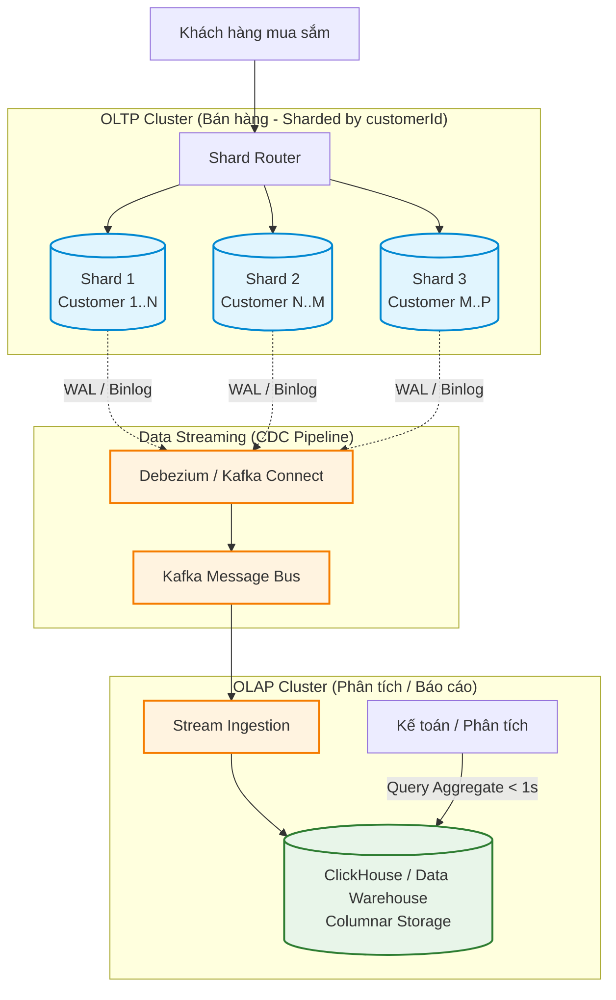

# Assignment 3: Vì sao báo cáo doanh thu cuối tháng bị chậm 6 tiếng và làm sập cả hệ thống bán hàng?

**Topics áp dụng:** Replication Strategies (Sync/Async), Database Sharding

## **1. Câu chuyện / Đề bài thực tế**

`Bối cảnh:
Công ty có 1 database duy nhất chứa bảng "orders" với 500 triệu 
dòng, không hề sharding. Traffic bán hàng (write) và traffic báo 
cáo (read/aggregate query) đều chạy chung 1 database.

Sự cố:
- Cuối tháng, Kế toán chạy 1 query tổng hợp doanh thu:
  SELECT SUM(total), COUNT(*), region FROM orders 
  WHERE created_at BETWEEN ... GROUP BY region
- Query này quét gần như toàn bộ 500 triệu dòng, chạy mất 6 tiếng,
  chiếm hết CPU và I/O của database.
- Trong lúc đó, khách hàng đang mua hàng (giờ cao điểm 20h-22h) bị 
  timeout hàng loạt vì Database quá tải, không xử lý kịp write.
- Doanh thu ước tính thiệt hại: hàng trăm triệu đồng vì khách bỏ 
  giỏ hàng.

Thêm bối cảnh: Traffic viết (write) đã tăng 10 lần trong 1 năm qua,
1 database instance không còn đủ sức xử lý cả read lẫn write.`

## **2. Câu hỏi**

`Q1: "Vấn đề gốc rễ (root cause) ở đây là gì? Có phải chỉ là 'query 
    chậm' không, hay còn nguyên nhân sâu xa hơn?"

Q2: "Giải pháp 'tách Replica riêng cho reporting' có giải quyết 
    triệt để vấn đề không? Tại sao có/không?"

Q3: "Nếu evaluate thêm sharding, các bạn sẽ chọn shard key nào cho
    bảng orders? Cân nhắc giữa customerId, region, và created_at."

Q4: "Giả sử chọn sharding theo thời gian (mỗi tháng 1 shard), 
    query báo cáo cuối tháng có nhanh hơn không? Có đánh đổi gì?"

Q5: "Sync hay Async replication phù hợp cho Replica dùng cho 
    reporting? Vì sao?"`

## **3. Lý thuyết áp dụng**

**Replication Strategies:**

- Vấn đề đầu tiên: chưa tách được Read replica cho reporting query ra khỏi Primary phục vụ giao dịch bán hàng.
- Cần Replica riêng cho reporting (OLAP-style), chấp nhận **asynchronous replication** vì báo cáo không cần real-time tuyệt đối.

**Database Sharding:**

- Vấn đề thứ hai, sâu hơn: dù có Replica, một dòng query quét 500 triệu bản ghi vẫn chậm vì dữ liệu không được **partition/shard**.
- Cần sharding theo `region` hoặc theo thời gian (`created_at`, ví dụ shard theo tháng/quý) để giảm khối lượng data mỗi lần quét.

## **4. Yêu cầu:**

- trả lời và đưa ra cách hiểu và xử lý bài toán vào file .md

---

## 5. Giải quyết bài tập

### Q1: Vấn đề gốc rễ (Root Cause)

Vấn đề tại đây không đơn thuần là "query chạy chậm", mà là sự cộng hưởng của 3 sai lầm kiến trúc cốt lõi:

1. Trộn lẫn tải OLTP (Giao dịch) và OLAP (Phân tích) trên cùng một Database Instance vật lý:
   - Tải OLTP (Khách mua hàng): Cần độ trễ cực thấp (< 50ms), tần suất cao, truy vấn đọc/ghi ngắn trên từng bản ghi đơn lẻ (`INSERT`, `UPDATE`).
   - Tải OLAP (Kế toán chạy báo cáo): Quét hàng trăm triệu dòng (`SUM`, `COUNT`, `GROUP BY`), tính toán aggregate nặng, độc chiếm 100% CPU, Disk I/O (Disk thrashing) và bộ đệm RAM (Buffer Pool).
   - Hậu quả: Query báo cáo đẩy toàn bộ dữ liệu giao dịch đang hot ra khỏi bộ nhớ cache, chiếm trọn Connection Pool khiến các lệnh tạo đơn hàng của khách hàng bị timeout hàng loạt (vấn đề *Noisy Neighbor* nội bộ).

2. Độc canh cơ sở dữ liệu (Single Instance Bottleneck):
   - Toàn bộ 500 triệu bản ghi và mọi tải đọc/ghi đều dồn vào 1 máy chủ duy nhất.
   - Bối cảnh ghi tăng 10 lần trong 1 năm qua khiến máy chủ đã chạm ngưỡng tới hạn phần cứng (CPU/Disk IOPS limit) ngay cả trong điều kiện bình thường.

3. Bảng dữ liệu phẳng khổng lồ, thiếu Partitioning và Pre-aggregation:
   - Không áp dụng phân vùng (Partitioning) theo tháng/năm, khiến cơ sở dữ liệu buộc phải đọc tuần tự từ đĩa cứng khối lượng dữ liệu khổng lồ.
   - Báo cáo chạy ad-hoc trực tiếp vào giờ cao điểm (20h - 22h) thay vì tính toán trước số liệu tích lũy (Pre-aggregated summary tables) hoặc chạy vào khung giờ thấp điểm (0h - 4h sáng).

---

### Q2: Đánh giá giải pháp "Tách Replica riêng cho reporting"

Giải pháp này KHÔNG giải quyết triệt để vấn đề.

#### Điểm giải quyết được (Tạm thời):
- Cách ly tài nguyên CPU/IO: Query báo cáo của kế toán chạy trên Replica sẽ ngốn CPU/IO của Replica đó, giải phóng Primary DB để tiếp tục phục vụ khách hàng mua hàng không bị timeout.

#### 2 lý do chí mạng khiến giải pháp chưa triệt để:
1. Query báo cáo của Kế toán VẪN CHẬM (vẫn mất 6 tiếng hoặc lâu hơn):
   - Bảng `orders` trên Replica vẫn là 500 triệu dòng dạng hàng (Row-oriented RDBMS). Cấu trúc lưu trữ này vốn không được thiết kế cho việc quét hàng triệu dòng dữ liệu để tính aggregate.
   - Khi Replica bị nghẽn 100% CPU/Disk trong suốt 6 tiếng, tiến trình nhận và áp dụng log ghi từ Primary bị đình trệ $\rightarrow$ Gây ra Replication Lag khổng lồ $\rightarrow$ Dữ liệu trên Replica bị cũ (stale), làm sai lệch kết quả báo cáo tài chính.
2. Primary DB vẫn sẽ sập vì quá tải GHI (Write Bottleneck):
   - Replica chỉ giúp mở rộng năng lực đọc (Read Scaling), hoàn toàn vô giá trị đối với việc mở rộng ghi (Write Scaling).
   - Khi lưu lượng ghi tiếp tục tăng trưởng theo đà 10x, nút Primary đơn lẻ sớm muộn cũng sẽ sụp đổ vì không chịu nổi lượng transaction ghi dồn về.

---

### Q3: Đánh giá và lựa chọn Shard Key tối ưu cho bảng `orders`

So sánh 3 ứng viên Shard Key:

| Shard Key ứng viên | Ưu điểm | Nhược điểm chí mạng | Đánh giá |
| :--- | :--- | :--- | :--- |
| `customerId` | Phân bổ tải Ghi và Đọc cực kỳ đồng đều qua hàm băm `hash(customerId)`. Tối ưu tuyệt đối cho 99.9% luồng giao dịch mua hàng thường ngày (tạo đơn, tra cứu lịch sử mua của user). | Truy vấn báo cáo tổng hợp theo `region` hoặc `created_at` sẽ thành Scatter-Gather (phải quét tất cả các shard). | LỰA CHỌN TỐI ƯU (Dành cho OLTP) |
| `region` | Query báo cáo có `GROUP BY region` có thể chạy theo từng vùng riêng biệt trên từng shard. | Lệch dữ liệu cực lớn (Data & Traffic Skew): Các thành phố lớn chiếm 70-80% lượng mua $\rightarrow$ Shard đó bị quá tải (Hot Shard), trong khi các shard vùng ít khách lại thừa thãi. | LOẠI BỎ |
| `created_at` (Theo thời gian) | Query `WHERE created_at BETWEEN ...` chỉ cần quét đúng shard của khoảng thời gian đó. Rất dễ archive/xóa dữ liệu cũ. | Hotspot ghi nghiêm trọng: 100% lượng đơn hàng mới chỉ đổ dồn vào đúng 1 Shard của tháng hiện tại. Năng lực Write Scaling bị triệt tiêu hoàn toàn. | LOẠI BỎ |

#### Kết luận & Nguyên tắc kiến trúc:
- Chọn `customerId` (hoặc `Smart Order ID: customerId + Timestamp`) làm Shard Key cho hệ thống OLTP.
- Nguyên tắc: Hệ thống bán hàng sống còn nhờ trải nghiệm giao dịch của khách hàng. Tuyệt đối không chọn Shard Key làm nghẽn luồng ghi bán hàng chỉ để phục vụ cho câu query báo cáo chạy 1 lần cuối tháng. Vấn đề báo cáo tổng hợp sẽ được giải quyết bằng hệ thống OLAP độc lập.

---

### Q4: Đánh giá Sharding theo thời gian (mỗi tháng 1 shard)

#### Query báo cáo cuối tháng có nhanh hơn không?
- CÓ, nhanh hơn đáng kể:
  - Thay vì quét toàn bộ 500 triệu dòng qua nhiều năm, câu lệnh `WHERE created_at BETWEEN ...` được Shard Router định tuyến thẳng vào đúng 1 Shard duy nhất của tháng cần báo cáo (chỉ chứa khoảng ~15–20 triệu dòng).
  - Khối lượng I/O giảm 25–30 lần, thời gian thực thi có thể giảm từ 6 tiếng xuống còn vài chục phút.

#### Đánh đổi (Trade-offs) nguy hiểm:
1. Hotspot Ghi (Write Bottleneck):
   - Toàn bộ 100% traffic tạo đơn hàng mới đều có `created_at` là ngày hôm nay $\rightarrow$ Toàn bộ tải ghi dồn thẳng vào 1 Shard tháng hiện tại. Kiến trúc Sharding hoàn toàn mất tác dụng chia tải ghi.
2. Lãng phí tài nguyên bất đối xứng (Resource Imbalance):
   - Shard tháng hiện tại chạy quá tải 100% CPU/Disk, trong khi các Shard của những tháng trước gần như không có tải ghi, rất ít tải đọc nhưng vẫn phải duy trì phần cứng tốn kém.
3. Làm chậm truy vấn của khách hàng (Cross-shard query):
   - Khi khách hàng truy cập trang "Lịch sử đơn hàng", hệ thống buộc phải phát tán truy vấn (Scatter-Gather) tới tất cả các Shard của 12 tháng qua để gộp kết quả, làm chậm nghiêm trọng trải nghiệm người dùng.

---

### Q5: Lựa chọn mô hình Replication cho Reporting Replica

Mô hình phù hợp bắt buộc là Asynchronous Replication (Bất đồng bộ).

#### 3 lý do kỹ thuật cốt lõi:
1. Bảo vệ tuyệt đối độ trễ và thông lượng ghi của Primary (Zero Write Latency Overhead):
   - Với Sync Replication, mỗi khi khách hàng bấm mua hàng, Primary phải đợi Replica ghi xong và gửi ACK xác nhận thì mới báo thành công cho khách. Khi Kế toán chạy query 6 tiếng chiếm trọn CPU/Disk của Replica, Replica phản hồi chậm $\rightarrow$ Khách hàng trên Primary sẽ bị nghẽn và timeout ngay lập tức (*Cascading Failure*).
   - Với Async Replication, Primary xác nhận đơn hàng thành công ngay tức thì (< 5ms) mà không phụ thuộc vào tình trạng tải của Replica.
2. Nghiệp vụ báo cáo chấp nhận Eventual Consistency:
   - Báo cáo tổng hợp tài chính/doanh thu tháng không cần số liệu tức thời từng mili-giây. Dữ liệu trễ (Replication Lag) từ vài giây đến vài phút là hoàn toàn có thể chấp nhận được trong phân tích quản trị.
3. Cách ly lỗi (Fault Isolation):
   - Nếu Reporting Replica bị quá tải hoặc sập do query aggregate quá nặng (OOM/Crash), Primary vẫn tiếp tục bán hàng bình thường mà không bị gián đoạn.

---

## 6. Kiến trúc hoàn chỉnh giải quyết triệt để bài toán (End-to-End Solution)

Để xử lý tận gốc cả hai bài toán: Write load tăng 10 lần và Báo cáo 500 triệu dòng chạy trong vài giây, kiến trúc chuẩn production cần tách biệt hoàn toàn giữa OLTP và OLAP:

- OLTP: Sharding theo `customerId` để dàn đều tải ghi và giải quyết bài toán write tăng gấp 10 lần.
- OLAP: Sử dụng Change Data Capture (CDC) đồng bộ bất đồng bộ sang cơ sở dữ liệu dạng cột (Column-oriented như ClickHouse/BigQuery). Các truy vấn `SUM`, `COUNT`, `GROUP BY` trên 500 triệu dòng sẽ trả về kết quả trong dưới 1 giây mà không làm ảnh hưởng dù chỉ 1% hiệu năng tới hệ thống bán hàng.
