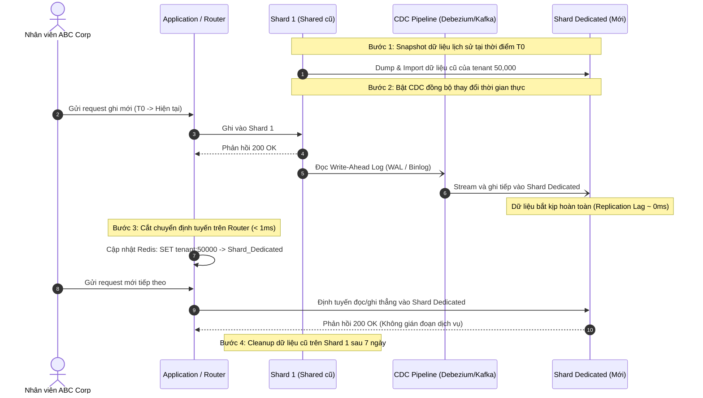

# Assignment 4: Vì sao 1 khách hàng VIP làm chậm cả hệ thống, còn 99% khách khác thì bình thường?
**Topics áp dụng:** Sharding Strategies (Hash vs Range), Sharding Challenges (Hot Spot, Re-sharding)

## **1. Đề bài thực tế**

`Bối cảnh:
Hệ thống SaaS multi-tenant (mỗi công ty khách hàng = 1 tenant) đã 
sharding database theo Range-based trên tenantId:
- Shard 1: tenantId 1 - 100,000
- Shard 2: tenantId 100,001 - 200,000
- Shard 3: tenantId 200,001 - 300,000

Vấn đề phát sinh:
- Công ty "ABC Corp" là khách hàng Enterprise lớn nhất, có tenantId 
  = 50,000 (rơi vào Shard 1).
- ABC Corp có 50,000 nhân viên sử dụng hệ thống hàng ngày, tạo ra 
  lượng traffic gấp 200 lần tenant trung bình.
- Toàn bộ traffic của ABC Corp dồn vào Shard 1.
- Shard 1 bị quá tải (CPU 95%, query latency tăng 10 lần), trong 
  khi Shard 2, Shard 3 gần như "rảnh rỗi" (CPU 15%).
- Tất cả các tenant KHÁC cũng nằm trong Shard 1 (do range 
  1-100,000 gồm rất nhiều tenant nhỏ) đều bị ảnh hưởng lây - đây 
  gọi là "noisy neighbor problem".

Câu hỏi từ sếp: "Tại sao ta có 3 shard, mà chỉ 1 shard chết, 2 
shard kia rảnh rang? Sao không tự cân bằng lại?"`

## **2. Câu hỏi**

`Q1: "Range-based sharding có công bằng về SỐ LƯỢNG tenant mỗi shard 
    không? Vậy tại sao vẫn bị quá tải?"

Q2: "Nếu đổi sang Hash-based sharding (hash(tenantId) % 3), vấn đề 
    này có được giải quyết không? Tại sao có/không?"

Q3: "Đây có phải là vấn đề mà 'đổi thuật toán sharding' là đủ để 
    giải quyết, hay cần thêm kiến trúc khác?"

Q4: "Nếu bạn là Architect, đề xuất giải pháp cho tenant lớn như 
    ABC Corp. Có bao nhiêu hướng giải quyết?"

Q5: "Giả sử chọn phương án 'tenant lớn có shard riêng', làm sao 
    migrate ABC Corp từ Shard 1 sang shard riêng MÀ KHÔNG DOWNTIME?"`

## **3. Lý thuyết áp dụng**

**Sharding Strategies (Hash vs Range):**

- Range-based sharding đang thất bại vì phân phối theo range tenantId, không quan tâm đến traffic thực tế của từng tenant.
- Đây là ví dụ điển hình của **Hot Spot** — 1 shard nhận tải vượt xa các shard khác dù số lượng tenant per shard tương đương.

**Sharding Challenges:**

- Cần phân biệt: **data distribution** (số tenant/shard) khác với **traffic distribution** (request/shard). Range sharding chỉ cân bằng cái đầu, không cân bằng cái sau.
- Giải pháp liên quan đến **re-sharding** hoặc **dedicated shard cho tenant lớn** (isolation strategy).

## **4. Yêu cầu:**

- trả lời và đưa ra cách hiểu và xử lý bài toán vào file .md

---

## 5. Giải quyết bài tập

### Q1: Đánh giá Range-based sharding về số lượng và nguyên nhân quá tải

1. Về số lượng tenant:
   - Range-based sharding hoàn toàn công bằng về mặt toán học định danh: Mỗi shard chứa chính xác 100,000 `tenantId`.

2. Tại sao Shard 1 vẫn bị quá tải (Nguyên nhân cốt lõi):
   - Ngộ nhận giữa Data Distribution (phân bổ số lượng ID) và Workload Distribution (lưu lượng truy cập thực tế).
   - Quy luật 80/20 (Pareto): Trong hệ thống SaaS, quy mô của các tenant không hề đồng nhất. ABC Corp là khách hàng Enterprise có 50,000 nhân viên, tạo lượng truy cập gấp 200 lần một tenant bình thường.
   - Range-based sharding phân chia cơ học theo dải số mà không đo lường tải thực tế. Việc xếp ABC Corp vào Shard 1 đã biến Shard 1 thành Hot Shard, chiếm dụng 95% CPU và Disk I/O.
   - Hệ quả Noisy Neighbor: Hàng chục ngàn tenant nhỏ trong dải 1 - 100,000 không hề tăng truy vấn nhưng vẫn bị treo và tăng độ trễ 10 lần do dùng chung tài nguyên phần cứng với ABC Corp.

---

### Q2: Đổi sang Hash-based sharding (hash(tenantId) % 3) có giải quyết được không?

Trả lời trực diện: KHÔNG giải quyết được.

Lý do kỹ thuật:
1. Bản chất của hàm băm: Thuật toán hash chỉ phân phối ngẫu nhiên và đồng đều các khóa định danh (`tenantId`), chứ không thể phân chia được khối lượng công việc bên trong một khóa.
2. Dữ liệu của ABC Corp chỉ gắn với một khóa duy nhất (`tenantId = 50,000`). Khi đi qua hàm băm `hash(50000) % 3`, kết quả chỉ cho ra đúng 1 shard duy nhất (ví dụ: Shard 2).
3. Hậu quả: Toàn bộ lưu lượng 200x của ABC Corp chỉ chuyển từ Shard 1 sang Shard 2. Shard 2 sẽ sập, và toàn bộ các tenant nhỏ vô tình bị băm vào Shard 2 sẽ trở thành nạn nhân Noisy Neighbor mới.

---

### Q3: Đổi thuật toán sharding có đủ không hay cần kiến trúc khác?

Trả lời trực diện: Đổi thuật toán sharding là KHÔNG ĐỦ.

Lý do kiến trúc:
1. Giới hạn của Sharding tĩnh: Cả Range-based và Hash-based tĩnh đều giả định các entity có kích thước tương đồng. Khi xuất hiện một "con voi" (Elephant Flow / Hot Tenant) có quy mô vượt trội hơn cả một máy chủ thông thường, mọi thuật toán phân chia cố định đều thất bại.
2. Cần chuyển dịch sang kiến trúc Directory-based Sharding kết hợp Phân tầng khách hàng (Tenant Tiering):
   - Thay vì ánh xạ cứng bằng công thức toán học (`id / 100000` hoặc `hash % 3`), hệ thống cần một bảng Lookup Table (Directory) được cache trên Redis để quản lý động: Tenant nào ở Shard nào.
   - Cho phép chỉ định vị trí đặt dữ liệu linh hoạt dựa theo quy mô doanh nghiệp và gói dịch vụ (SLA).

---

### Q4: Đề xuất các hướng giải quyết cho tenant lớn (ABC Corp)

Có 3 hướng giải quyết kiến trúc:

| Hướng giải quyết | Cơ chế thực hiện | Đánh giá |
| :--- | :--- | :--- |
| Hướng 1: Dedicated Shard (Shard riêng độc lập) | Cấp riêng một cụm database cấu hình cao chỉ phục vụ duy nhất ABC Corp. Tách biệt hoàn toàn khỏi cụm Shared Shards của các tenant nhỏ. Định tuyến qua Directory Table trên Redis. | LỰA CHỌN TỐI ƯU NHẤT (Cách ly lỗi 100%, bảo mật cao, đáp ứng cam kết SLA Enterprise). |
| Hướng 2: Tenant Sub-sharding (Chia nhỏ nội bộ tenant) | Sử dụng Shard Key phức hợp: `tenantId + hash(userId)`. Dữ liệu của riêng ABC Corp được phân mảnh ra nhiều máy chủ con bên dưới. | Phức tạp cao: Mất tính toàn vẹn ACID cấp tenant, ứng dụng phải viết lại logic truy vấn phân tán. Chỉ dùng khi 1 máy chủ cực mạnh cũng không chứa nổi 1 tenant. |
| Hướng 3: Multi-tier Sharding (Phân nhóm theo quy mô) | Chia các shard thành từng phân khúc: Shard VIP (chứa 1-5 khách Enterprise lớn), Shard Standard (chứa 500 khách tầm trung), Shard Free (chứa 50,000 khách nhỏ/dùng thử). | Tốt cho việc tối ưu chi phí hạ tầng, nhưng vẫn tiềm ẩn nguy cơ 2 khách Enterprise cạnh tranh tài nguyên nếu xếp chung shard VIP. |

---

### Q5: Quy trình Migrate ABC Corp sang Dedicated Shard không downtime

Áp dụng quy trình Zero-downtime Migration 4 bước (Change Data Capture / Dual-write Pattern):

Chi tiết 4 bước:
1. Bước 1: Khởi tạo Dedicated Shard & Snapshot dữ liệu lịch sử
   - Cấp máy chủ database riêng (Shard Dedicated).
   - Export toàn bộ dữ liệu có `tenantId = 50000` trên Shard 1 tại thời điểm $T_0$ và nạp vào Shard Dedicated.
2. Bước 2: Đồng bộ thay đổi liên tục qua CDC (Catch-up phase)
   - Cấu hình Change Data Capture (Debezium đọc Binlog của Shard 1) bắt mọi sự kiện `INSERT`, `UPDATE`, `DELETE` phát sinh từ thời điểm $T_0$ trở đi và áp dụng vào Shard Dedicated.
   - Chờ hệ thống đồng bộ bắt kịp thời gian thực (Replication Lag tiến về 0ms).
3. Bước 3: Cắt chuyển định tuyến (Zero-downtime Cutover)
   - Cập nhật định tuyến trong Shard Router (Redis Cache):
     `SET tenant:routing:50000 shard_dedicated_abc`
   - Kể từ thời điểm này, mọi request của ABC Corp được chuyển thẳng sang máy chủ mới trong vòng < 1ms mà người dùng không cảm nhận bất kỳ độ trễ hay lỗi gián đoạn nào.
4. Bước 4: Dọn dẹp dữ liệu cũ (Cleanup)
   - Sau khi Shard Dedicated chạy ổn định 3 - 7 ngày, tiến hành xóa dữ liệu của ABC Corp trên Shard 1 vào ban đêm để giải phóng dung lượng đĩa và I/O cho các tenant nhỏ còn lại.
