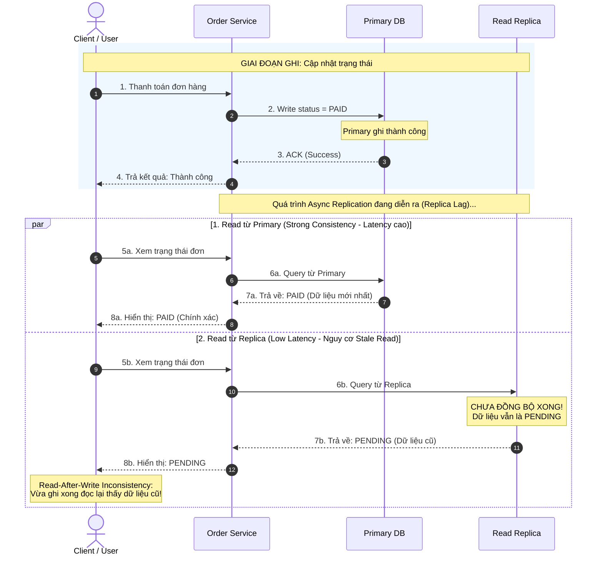

# PHÂN TÍCH ĐỊNH LÝ PACELC — HỆ THỐNG ORDER SERVICE

## 1. Định lý PACELC mở rộng CAP ở điểm nào?

### Điểm hạn chế của CAP Theorem:
CAP chỉ tập trung vào thời điểm hệ thống xảy ra sự cố đứt mạng (Network Partition - P): Khi đó buộc phải chọn giữa Availability (A) hoặc Consistency (C).

Tuy nhiên, trong thực tế, hệ thống hoạt động ở trạng thái bình thường (không đứt mạng) trong phần lớn thời gian (99.9%). CAP không mô tả được sự đánh đổi trong điều kiện bình thường này.

### Điểm mở rộng của PACELC Theorem:
PACELC bổ sung câu hỏi quan trọng cho trạng thái bình thường:

```text
If Partition happens:
    choose Availability or Consistency (A vs C)
Else, when there is no Partition:
    choose Latency or Consistency (L vs C)
```

* Khi có sự cố đứt mạng (P): Đánh đổi giữa A (Sẵn sàng phục vụ) và C (Nhất quán dữ liệu).
* Khi mạng bình thường (E - Else): Đánh đổi giữa L (Độ trễ thấp / Phản hồi nhanh) và C (Nhất quán mạnh).

> Ý nghĩa thực tế:
> * Read nhanh hơn không đồng nghĩa với dữ liệu luôn mới nhất: Để có độ trễ thấp (Low Latency - L), hệ thống cho phép đọc ngay từ Replica mà không cần chờ đồng bộ xong. Điều này dẫn đến việc người đọc có thể thấy dữ liệu cũ (*stale data*).
> * Để có dữ liệu luôn mới nhất (Strong Consistency - C): Primary phải chờ Replica xác nhận đồng bộ hoặc client phải đọc trực tiếp từ Primary, khiến thời gian phản hồi lâu hơn (High Latency).

---

## 2. Bảng phân tích Trade-off cho 4 Scenario của Order Service

| Scenario | Ưu tiên | Lý do |
| :--- | :---: | :--- |
| User vừa thanh toán xong và xem trạng thái đơn | Strong Consistency | Sau khi thanh toán thành công, người dùng cần thấy ngay trạng thái đơn đã chuyển sang `PAID`. Nếu chọn Low Latency và đọc từ Replica chưa đồng bộ, người dùng thấy trạng thái vẫn là `PENDING` $\rightarrow$ gây hoang mang, hiểu lầm thanh toán thất bại và có thể thực hiện thanh toán lại. |
| Trang danh sách sản phẩm | Low Latency | Khách hàng cần duyệt danh mục nhanh, mượt mà với thời gian tải trang thấp (< 100ms). Việc thông tin hiển thị (tồn kho, mô tả) bị trễ vài giây so với bản ghi mới nhất trên Primary là hoàn toàn chấp nhận được và không ảnh hưởng nghiêm trọng đến nghiệp vụ. |
| Admin xem báo cáo doanh thu cuối ngày | Strong Consistency | Dữ liệu báo cáo phục vụ cho quyết toán tài chính, kế toán và quản trị nên yêu cầu độ chính xác tuyệt đối. Thời gian truy vấn có thể chậm vài giây (chấp nhận Latency cao) để đảm bảo không bị thiếu sót bất kỳ đơn hàng nào. |
| Kiểm tra số dư ví điện tử | Strong Consistency | Số dư là dữ liệu tài chính nhạy cảm. Nếu ưu tiên Low Latency và đọc số dư cũ từ Replica, người dùng có thể thực hiện các giao dịch vượt quá số dư thực tế (*Double-spending*). Vì vậy, mọi thao tác đọc/kiểm tra số dư phải lấy dữ liệu mới nhất. |

---

## 3. Sơ đồ so sánh luồng Đọc & Read-After-Write Inconsistency



## 4. Giải pháp xử lý Read-After-Write Inconsistency

Để đảm bảo người dùng không gặp dữ liệu cũ sau khi ghi mà vẫn tận dụng được Read Replica:

1. Read từ Primary trong một khoảng thời gian sau Write:
   - Khi một user vừa thực hiện Write, hệ thống đánh dấu và định tuyến các request Read của chính user đó về Primary DB trong một khoảng thời gian ngắn (ví dụ: 3 - 5 giây).
   - Các request đọc khác từ người dùng khác vẫn đọc từ Replica bình thường.
2. Session Consistency / Read-Your-Writes:
   - Đảm bảo trong cùng một session, client luôn đọc được dữ liệu mà chính session đó đã ghi.
3. Trả dữ liệu mới ngay trong response của lệnh Write:
   - Sau khi cập nhật thành công, API Write trả về luôn trạng thái mới (`PAID`) trong body response để giao diện cập nhật ngay, không cần gọi thêm request Read.


