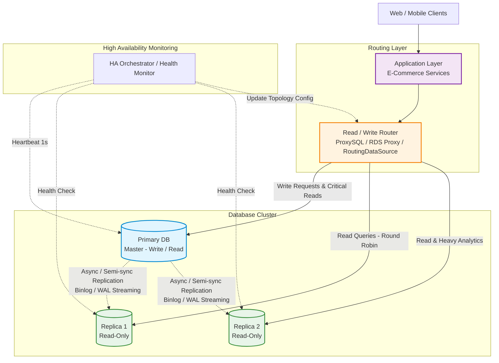
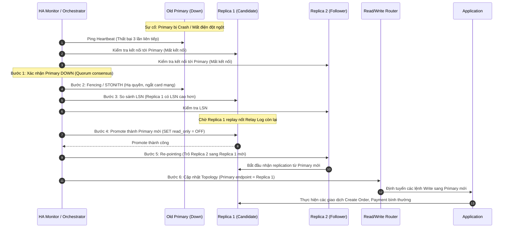

# Replication Architecture: Hệ thống E-Commerce

## 1. Sơ đồ kiến trúc (Architecture Diagram)

Kiến trúc bao gồm:
- Application Services: Tầng ứng dụng xử lý nghiệp vụ E-Commerce (Order, Payment, Catalog, Analytics).
- Read/Write Router: Tầng trung gian điều phối truy vấn (ví dụ ProxySQL, AWS RDS Proxy, hoặc Spring `AbstractRoutingDataSource`).
- Primary Database (Leader): Một node duy nhất xử lý toàn bộ thao tác Ghi (Write) và các thao tác Đọc đòi hỏi dữ liệu tức thời (Critical Reads / Read-your-writes).
- Two Replicas (Followers): Hai node chỉ đọc (`read_only = ON`), nhận dữ liệu đồng bộ bất đồng bộ hoặc bán đồng bộ từ Primary để chia sẻ tải đọc (Read Scaling).

---

## 2. Bảng quy tắc định tuyến (Read/Write Routing Rules)

| Loại request | Đi đến đâu | Lý do |
| :--- | :--- | :--- |
| Create order | Primary DB | là thao tác ghi (Write - `INSERT INTO orders ...`), thay đổi trạng thái hệ thống, tạo mã đơn và trừ tồn kho. Bắt buộc phải thực hiện trên Primary để đảm bảo tính toàn vẹn giao dịch (ACID) và tránh xung đột dữ liệu (Split-Brain). |
| Update payment status | Primary DB | là thao tác ghi cập nhật (Write - `UPDATE orders SET status = 'PAID' ...`), liên quan trực tiếp đến tiền bạc và số dư tài chính. Thuộc nhóm dữ liệu nhạy cảm cao (Financial Invariant), yêu cầu tính nhất quán tuyệt đối (Strong Consistency), không được phép xử lý trên Replica. |
| Get product catalog | Replicas (Replica 1 hoặc Replica 2 qua Load Balancer) | Thao tác chỉ đọc (Read-only) chiếm tỷ trọng lớn nhất hệ thống (80–90% traffic). Dữ liệu danh mục, mô tả sản phẩm ít biến động liên tục; chấp nhận độ trễ vài giây nếu có replication lag (Eventual Consistency). Việc định tuyến sang Replicas giúp giảm tải tối đa cho Primary (Read Scaling). |
| Get order vừa tạo | Primary DB (hoặc ghim đọc Primary trong 3–5 giây đầu qua Time-window Routing) | là tình huống Read-after-write (Read-Your-Writes Consistency). Khách hàng vừa đặt hàng xong bấm xem chi tiết đơn ngay lập tức. Do tồn tại độ trễ sao chép (Replication Lag), nếu chuyển hướng ngay sang Replica thì Replica có thể chưa nhận kịp bản ghi mới $\rightarrow$ Khách hàng thấy đơn trống hoặc trạng thái cũ, gây hoang mang tưởng đơn bị hủy hoặc lỗi hệ thống. |
| View reporting dashboard | Replica 2 (hoặc Replica chuyên dụng cho Analytics) | Báo cáo kinh doanh thường chạy các câu truy vấn phức tạp (quét bảng lớn, `SUM`, `AVG`, `GROUP BY`, `JOIN` nhiều bảng). Nếu chạy trên Primary sẽ làm nghẽn CPU, chiếm dụng RAM và khóa connection pool của các giao dịch mua hàng. Đọc từ Replica riêng biệt giúp cách ly tải phân tích (OLAP) khỏi tải giao dịch trực tuyến (OLTP). |

---

## 3. Tình huống Primary Down & Cơ chế Failover

### 3.1. Trả lời các câu hỏi tình huống

#### 1. Hệ thống phát hiện thế nào? (Failure Detection)
- Sử dụng công cụ điều phối và giám sát độc lập (như Orchestrator, Consul, hoặc AWS RDS Auto-Failover).
- Node giám sát gửi tín hiệu kiểm tra định kỳ (Heartbeat ping) tới Primary mỗi 1 giây.
- Để tránh báo động giả do đứt mạng cục bộ của node giám sát (False Positive / Network Glitch), hệ thống áp dụng cơ chế xác thực chéo (Cross-check):
  - Node giám sát kiểm tra thấy Primary không phản hồi quá ngưỡng (ví dụ 3 lần liên tiếp trong 3 giây).
  - Đồng thời hỏi thăm Replica 1 và Replica 2 xem có mất kết nối tới Primary hay không.
  - Khi đa số (Quorum) xác nhận không thể kết nối tới Primary $\rightarrow$ Chính thức tuyên bố Primary bị DOWN.

#### 2. Replica nào được promote làm Primary mới? (Replica Selection & Election)
- Tiêu chuẩn bất biến: Chọn Replica có dữ liệu mới nhất, tức là node có Replication Lag thấp nhất (vị trí Log Sequence Number - LSN cao nhất).
- Cơ chế lựa chọn:
  - Hệ thống so sánh vị trí log đã nhận giữa 2 Replicas:
    - Trong MySQL: So sánh `Executed_Gtid_Set`.
    - Trong PostgreSQL: So sánh `pg_last_wal_replay_lsn()`.
  - Node nào có LSN lớn hơn (đã nhận nhiều log nhất từ Primary cũ trước khi sập) sẽ được chọn làm ứng viên thăng cấp (Candidate).
  - Nếu cả hai Replicas có mức LSN bằng nhau, hệ thống ưu tiên chọn node có cấu hình phần cứng tốt hơn hoặc theo thứ tự ưu tiên được cấu hình sẵn (`Failover Priority Weight`).

#### 3. Application cần cập nhật gì? (Application & Traffic Update)
- Application không hardcode IP cụ thể của Database.
- Việc chuyển đổi lưu lượng được xử lý ở tầng kết nối thông qua một trong ba phương án:
  - Tầng Router / Proxy (Khuyên dùng): Read/Write Router (ProxySQL, HAProxy, AWS RDS Proxy) tự động nhận diện topology mới từ Orchestrator và chuyển hướng kết nối Write sang node mới. Application không cần khởi động lại.
  - Cập nhật DNS nội bộ: Bản ghi DNS `db-primary.internal` được trỏ sang IP của Primary mới với TTL ngắn (1–3 giây). Application sẽ tự động phân giải sang IP mới ở connection tiếp theo.
  - Connection Pool Reset: Application nhận tín hiệu lỗi `Connection Closed` từ pool cũ (HikariCP) và tự động tạo lại kết nối mới trỏ về endpoint của Primary vừa được thăng cấp.

---

### 3.2. Quy trình Failover chi tiết (6 bước chuẩn hóa)

#### Giải thích:
1. Bước 1: Phát hiện sự cố (Failure Detection): Node giám sát xác nhận Primary không phản hồi quá 3 lần liên tiếp và các Replicas đều mất kết nối đồng bộ.
2. Bước 2: Cô lập node cũ (Fencing / Node Isolation): Thực hiện ngắt hoàn toàn quyền ghi hoặc tắt nguồn Primary cũ (STONITH - Shoot The Other Node In The Head) để phòng tránh hiện tượng Split-Brain (hai node cùng tưởng mình là Primary và nhận write đồng thời).
3. Bước 3: Chọn ứng viên và áp dụng log tồn (Candidate Election & Catch-up): So sánh LSN và chọn Replica 1. Ra lệnh cho Replica 1 áp dụng toàn bộ log còn nằm trong Relay Log để đạt trạng thái nhất quán tối đa.
4. Bước 4: Nâng cấp thành Primary mới (Promotion): Chuyển chế độ của Replica 1 từ Read-only sang Read/Write (`SET GLOBAL read_only = OFF` trong MySQL hoặc gọi `pg_promote()` trong PostgreSQL).
5. Bước 5: Tái cấu hình Replica còn lại (Re-pointing Follower): Cấu hình Replica 2 dừng kết nối với Primary cũ và chuyển sang nhận replication stream từ Replica 1 mới (`CHANGE REPLICATION SOURCE TO ...`).
6. Bước 6: Cập nhật định tuyến ứng dụng (Router Re-configuration): Cập nhật bảng định tuyến trên Router (hoặc cập nhật DNS). Application tiếp tục gửi các câu lệnh Ghi và Đọc mà không bị gián đoạn kéo dài.
