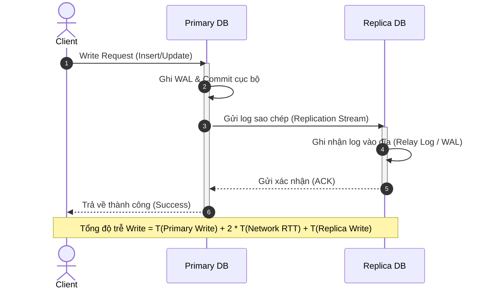
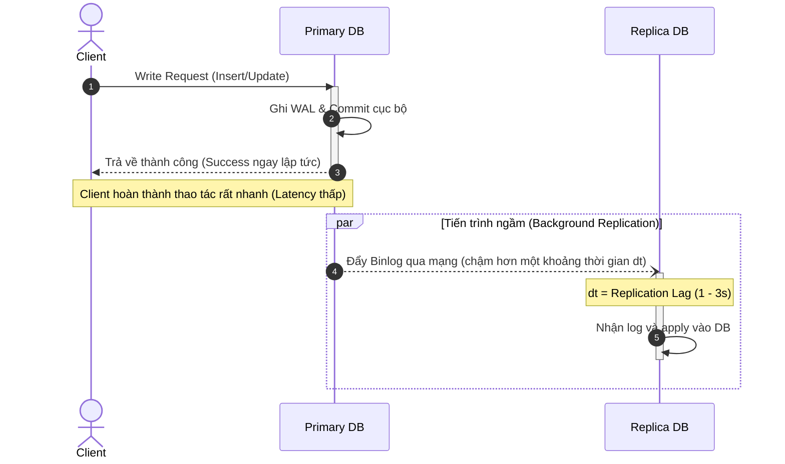
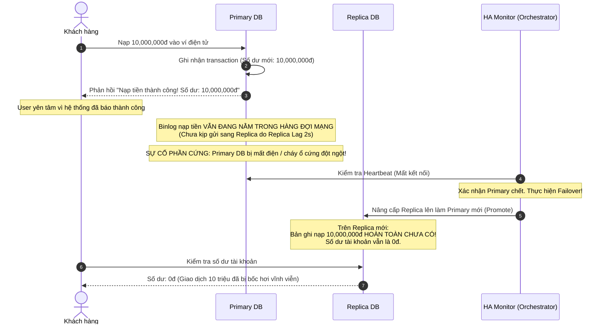

# Replication Strategies

Tài liệu so sánh chi tiết các chiến lược sao chép dữ liệu (Synchronous, Asynchronous, Semi-synchronous), minh họa timeline hoạt động, phân tích rủi ro mất mát dữ liệu và lựa chọn chiến lược phù hợp cho các use case thực tế.

---

## 1. Bảng so sánh các chiến lược sao chép

| Tiêu chí | Synchronous | Asynchronous | Semi-synchronous |
| :--- | :--- | :--- | :--- |
| Write latency | Rất cao (Phụ thuộc vào thời gian Primary ghi đĩa + Round-trip mạng tới toàn bộ Replicas + thời gian ghi đĩa của Replica chậm nhất). | Rất thấp (Chỉ phụ thuộc vào thời gian ghi đĩa cục bộ trên Primary DB, không đợi phản hồi từ mạng). | Trung bình (Phụ thuộc vào thời gian Primary ghi đĩa + 1 Round-trip mạng tới Replica phản hồi nhanh nhất). |
| Data durability | Rất cao (Dữ liệu đã nằm trên toàn bộ các node ngay tại thời điểm báo thành công cho client). | Thấp - Trung bình (Dữ liệu chỉ nằm trên Primary; nếu Primary chết đột ngột trước khi kịp gửi log, dữ liệu sẽ mất). | Cao (Đảm bảo dữ liệu đã được lưu trên ít nhất 2 node vật lý: Primary và tối thiểu 1 Replica trước khi trả về thành công). |
| Replica lag | Không có (Lag = 0s, dữ liệu trên Replicas luôn đồng nhất tức thì với Primary). | Có thể xuất hiện (từ vài chục mili-giây đến vài giây/vài phút tùy thuộc vào tải mạng và hàng đợi I/O của Replica). | Không đáng kể trên Replica được chọn để sync; các Replicas còn lại có thể có độ trễ nhẹ. |
| Rủi ro data loss | Không có (Zero data loss). | Cao (Tồn tại khoảng thời gian Data-loss window bằng đúng độ dài của Replication lag khi Primary bị crash). | Rất thấp (Chỉ mất dữ liệu nếu cả Primary và Replica nhận log cùng bị sập đồng thời). |
| Use case phù hợp | Hệ thống ngân hàng lõi (Core banking), kiểm toán tài chính, viễn thông khắt khe. | Hệ thống mạng xã hội, catalog sản phẩm, logs, phân tích hành vi người dùng (Clickstream). | Hệ thống thương mại điện tử (đơn hàng, thanh toán), cổng thanh toán, SaaS B2B. |

---

## 2. Timeline minh họa hoạt động

### 2.1. Synchronous Write Timeline

Trong mô hình Synchronous, Primary DB chỉ phản hồi thành công (`200 OK`) cho Client sau khi tất cả các Replica đã nhận dữ liệu, ghi vào đĩa và gửi xác nhận (ACK).

- **Đặc điểm:** Client bắt buộc phải chờ toàn bộ hành trình mạng khứ hồi (Round-Trip Time - RTT) giữa Primary và Replica. Nếu một Replica bị chậm hoặc treo mạng, toàn bộ tiến trình ghi của hệ thống bị tắc nghẽn.

---

### 2.2. Asynchronous Write Timeline

Trong mô hình Asynchronous, Primary DB commit và phản hồi thành công cho Client ngay sau khi ghi xong vào đĩa cục bộ. Việc đẩy dữ liệu sang Replica diễn ra hoàn toàn độc lập trong tiến trình chạy ngầm (background).

- **Đặc điểm:** Tối ưu tối đa độ trễ ghi cho Client. Tuy nhiên, tồn tại một khoảng thời gian trễ $dt$ (Replication Lag) mà trong khoảng đó dữ liệu mới chỉ tồn tại duy nhất trên Primary DB.

---

## 3. Tình huống thực tế: Mất dữ liệu trong Asynchronous Replication

### 3.1. Kịch bản sự cố (The Incident Flow)

Một trường hợp mất dữ liệu điển hình trong hệ thống thanh toán sử dụng Asynchronous Replication:

### 3.2. Phân tích nguyên nhân và Data-loss Window
- **Khái niệm Data-loss Window:** Là khoảng thời gian giữa lúc một giao dịch được ghi nhận trên Primary và lúc bản ghi đó được đồng bộ thành công sang Replica. Trong Asynchronous Replication, cửa sổ này luôn lớn hơn 0 và bằng đúng thời gian **Replication Lag**.
- **Hậu quả:** 
  - Hệ thống đã gửi cam kết với người dùng (đã gửi ACK cho Client), nhưng dữ liệu vật lý chưa kịp thoát ra khỏi một máy chủ duy nhất.
  - Khi máy chủ đó gặp thảm họa (Hardware failure / Data center crash), dữ liệu biến mất hoàn toàn mà không thể khôi phục tự động.
  - Đây là lý do vì sao Asynchronous Replication **tuyệt đối không được sử dụng đơn lẻ cho dữ liệu tài chính**.

---

## 4. Phân tích và lựa chọn chiến lược cho 5 Use Cases

### 1. Payment transaction (Giao dịch thanh toán)
- **Chiến lược lựa chọn:** **Semi-synchronous Replication** (hoặc Synchronous nếu các node đặt cùng một Data Center có mạng nội bộ tốc độ cao).
- **Lý do lựa chọn:**
  - Dữ liệu tiền tệ đòi hỏi độ bền vững dữ liệu (Data Durability) cao nhất. Khi hệ thống đã báo trừ tiền hoặc nạp tiền thành công, dữ liệu bắt buộc phải an toàn.
  - Sử dụng Semi-synchronous đảm bảo giao dịch đã được ghi nhận trên ít nhất 2 máy chủ vật lý (Primary và 1 Replica) trước khi trả phản hồi về cho khách hàng. Nếu Primary sập, Replica kia đã có sẵn dữ liệu để thăng cấp làm Primary mới mà không bị mất đồng nào (Zero Data-loss).
  - So với Synchronous hoàn toàn, Semi-synchronous chỉ cần chờ 1 Replica nhanh nhất phản hồi, giúp giữ độ trễ ghi ở mức chấp nhận được và không bị nghẽn nếu một Replica khác bị chậm mạng.

### 2. Product catalog (Danh mục sản phẩm)
- **Chiến lược lựa chọn:** **Asynchronous Replication**.
- **Lý do lựa chọn:**
  - Dữ liệu danh mục (thêm sản phẩm mới, cập nhật giá niêm yết, sửa mô tả sản phẩm) do nhân viên quản trị (Admin) thực hiện với tần suất thấp, nhưng người dùng đọc với tần suất cực lớn (hàng chục nghìn lượt xem mỗi giây).
  - Dữ liệu này nếu có hiển thị chậm 1–2 giây trên Replicas sau khi admin cập nhật thì hoàn toàn không gây thiệt hại kinh tế nào (Eventual Consistency).
  - Asynchronous giúp tối ưu hóa tối đa tốc độ ghi cho hệ thống quản trị và tiết kiệm băng thông mạng giữa các node.

### 3. Application logs (Log ứng dụng)
- **Chiến lược lựa chọn:** **Asynchronous Replication**.
- **Lý do lựa chọn:**
  - Log ứng dụng sinh ra với tần suất rất cao (hàng nghìn đến hàng chục nghìn dòng log mỗi giây).
  - Yêu cầu quan trọng nhất của ghi log là **không bao giờ được làm chậm luồng xử lý chính** của ứng dụng (Low Write Latency).
  - Nếu Primary sập và mất đi một vài dòng log trong khoảng thời gian vài giây gần nhất, hệ thống vẫn chấp nhận được và không ảnh hưởng đến tính toàn vẹn của dữ liệu nghiệp vụ khách hàng.

### 4. Notification delivery history (Lịch sử gửi thông báo)
- **Chiến lược lựa chọn:** **Asynchronous Replication**.
- **Lý do lựa chọn:**
  - Lịch sử gửi thông báo (Push notification, SMS marketing, email khuyến mãi) là dữ liệu phụ trợ.
  - Việc lưu trữ lịch sử chỉ phục vụ mục đích thống kê, tra cứu thứ cấp. Không có quy định pháp lý hoặc tài chính nào đòi hỏi tính nhất quán tức thì tại thời điểm ghi.
  - Sử dụng Asynchronous để giải phóng tài nguyên xử lý cho các tác vụ quan trọng hơn.

### 5. Analytics events (Sự kiện phân tích dữ liệu / Clickstream)
- **Chiến lược lựa chọn:** **Asynchronous Replication**.
- **Lý do lựa chọn:**
  - Dữ liệu sự kiện phân tích (lượt click, hành vi xem trang, thời gian on-site) có khối lượng cực lớn (hàng triệu sự kiện mỗi phút).
  - Nếu sử dụng Synchronous hoặc Semi-synchronous, độ trễ mạng tích lũy sẽ làm sập toàn bộ hệ thống lưu trữ ngay lập tức.
  - Trong phân tích dữ liệu lớn, tính toán dựa trên mô hình thống kê tổng hợp (Statistical sampling); việc chấp nhận mất mát một tỷ lệ cực nhỏ sự kiện (< 0.01%) khi có sự cố là quy chuẩn kỹ thuật được chấp nhận rộng rãi để đổi lấy hiệu năng xử lý cao nhất.

---

## 5. Tiêu chí hoàn thành (Self-Check Checklist)

- [x] **Giải thích được Replication Acknowledgement (ACK):** Là tín hiệu phản hồi xác nhận từ Replica gửi về cho Primary, chứng minh rằng Replica đã nhận được log và ghi an toàn vào bộ nhớ đệm hoặc ổ đĩa (Relay Log).
- [x] **Phân biệt được Latency và Durability:** Latency là thời gian phản hồi mà Client phải chờ đợi; Durability là mức độ an toàn và khả năng tồn tại của dữ liệu trước các sự cố sập phần cứng. Luôn có sự đánh đổi giữa hai yếu tố này.
- [x] **Hiểu Data-loss Window của Asynchronous Replication:** Là khoảng thời gian dữ liệu mới chỉ nằm trên Primary mà chưa kịp gửi sang Replica; nếu Primary chết trong khoảng này, toàn bộ dữ liệu trong cửa sổ đó sẽ bị mất vĩnh viễn.
- [x] **Chọn được chiến lược phù hợp cho từng use case cụ thể:** Phân loại rõ ràng khi nào cần an toàn tuyệt đối (Payment $\rightarrow$ Semi-synchronous) và khi nào cần tối ưu hiệu năng/tốc độ (Catalog, Logs, Analytics $\rightarrow$ Asynchronous).
