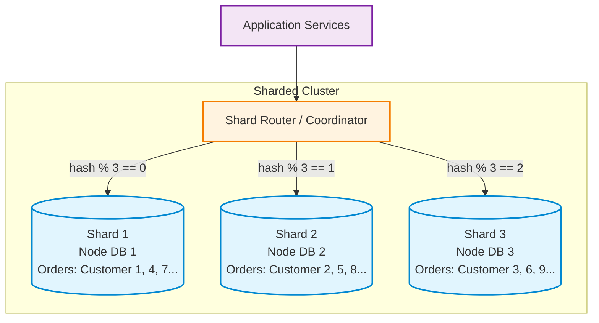

# Sharding Basics: Phân mảnh dữ liệu hệ thống E-Commerce

Tài liệu so sánh giữa Replication và Sharding, phân tích lựa chọn Shard Key cho bảng `orders` dựa trên các truy vấn thực tế và đề xuất phương án tối ưu.

---

## 1. Sơ đồ kiến trúc Sharding (3 Shards)

Kiến trúc phân chia bảng `orders` thành 3 node cơ sở dữ liệu độc lập (Shards) thông qua Shard Router sử dụng hàm băm `hash(shard_key) % 3`:

- Mỗi Shard là một máy chủ database vật lý/ảo hóa riêng biệt (CPU, RAM, Disk độc lập).
- Mỗi Shard chỉ lưu trữ và xử lý một phần dữ liệu (~33.3% tổng số đơn hàng).
- Lưu lượng ghi (Write load) và lưu lượng đọc (Read load) được phân tải đều sang 3 máy chủ, giúp hệ thống scale ngang khả năng ghi (Write Scaling).

---

## 2. So sánh Replication vs Sharding

| Tiêu chí | Replication (Sao chép) | Sharding (Phân mảnh ngang) |
| :--- | :--- | :--- |
| Bản chất dữ liệu | Nhân bản cùng 1 tập dữ liệu đầy đủ (100%) sang nhiều node (Primary và các Replicas). | Chia nhỏ dữ liệu thành các phân vùng không trùng lặp (mỗi node chỉ lưu $1/N$ tổng dữ liệu). |
| Mục tiêu cốt lõi | Tăng tính sẵn sàng (High Availability) và mở rộng đọc (Read Scaling). | Mở rộng ghi (Write Scaling) và mở rộng dung lượng lưu trữ (Storage Scaling). |
| Khả năng Write Scaling | Không hỗ trợ: Toàn bộ lệnh Ghi vẫn dồn vào một node Primary duy nhất (nút thắt cổ chai ghi). | Hỗ trợ rất tốt: Lưu lượng Ghi được chia đều ra $N$ shards, thông lượng ghi tăng tuyến tính theo số node. |
| Giới hạn lưu trữ (Storage) | Giới hạn bởi dung lượng đĩa của 1 máy chủ lớn nhất (Single machine disk limit). | Mở rộng không giới hạn (Tổng dung lượng = $\sum$ dung lượng của tất cả các Shards cộng lại). |
| Độ phức tạp truy vấn | Đơn giản: Hỗ trợ trọn vẹn ACID transaction nội bộ, `JOIN` nhiều bảng dễ dàng. | Phức tạp: Hạn chế `JOIN` xuyên shard (Cross-shard JOIN), cần Distributed Transactions (2PC / Saga). |
| Vận hành & Mở rộng | Dễ: Thêm replica để đọc, cấu hình tự động failover khi primary sập. | Phức tạp: Cần Shard Router, quản lý dữ liệu bị lệch (Data Skew), cơ chế chia lại shard (Re-sharding). |

---

## 3. Phân tích các ứng viên Shard Key cho bảng `orders`

Xét 4 ứng viên: `orderId`, `customerId`, `createdAt`, `countryCode` đối với 4 truy vấn thực tế:
- Q1: Lấy tất cả orders của một customer (`SELECT * FROM orders WHERE customerId = ?`)
- Q2: Tạo order cho customer (`INSERT INTO orders (orderId, customerId, ...) VALUES (...)`)
- Q3: Tìm order theo orderId (`SELECT * FROM orders WHERE orderId = ?`)
- Q4: Báo cáo doanh thu toàn hệ thống theo tháng (`SELECT SUM(amount) FROM orders WHERE createdAt BETWEEN ? AND ?`)

### Bảng ma trận đánh giá:

| Shard Key ứng viên | Q1: Lấy orders của 1 customer | Q2: Tạo order cho customer | Q3: Tìm order theo orderId | Q4: Báo cáo doanh thu theo tháng | Đánh giá tổng quan |
| :--- | :--- | :--- | :--- | :--- | :--- |
| `customerId` | Single-shard (Cực nhanh): Trỏ thẳng 1 shard duy nhất chứa toàn bộ lịch sử đơn của khách. | Single-shard (Cực nhanh): Ghi trực tiếp vào 1 shard của customer đó. | Scatter-Gather (Chậm): Phải broadcast query đến toàn bộ 3 shards rồi gộp kết quả lại (vì không biết đơn thuộc khách nào). | Scatter-Gather (Chậm): Quét qua tất cả shards để cộng dồn doanh thu. | Tốt nhất cho nghiệp vụ người dùng. Gom cụm dữ liệu khách hàng, tối ưu 90% tương tác OLTP. Nhược điểm ở Q3 xử lý được bằng Smart ID. |
| `orderId` | Scatter-Gather (Rất chậm): Đơn hàng của 1 khách bị phân tán trên nhiều shards. Mở trang lịch sử mua hàng phải query toàn bộ shards. | Single-shard (Nhanh): Ghi vào shard dựa theo `hash(orderId)`. | Single-shard (Cực nhanh): Trỏ thẳng vào đúng 1 shard chứa mã đơn hàng. | Scatter-Gather (Chậm): Quét qua tất cả shards. | Dữ liệu chia rất đều, tra cứu đơn lẻ cực tốt nhưng làm giảm nghiêm trọng trải nghiệm người dùng khi xem danh sách đơn hàng. |
| `createdAt` | Scatter-Gather: Khách mua hàng qua nhiều tháng/năm thì đơn hàng nằm rải rác ở nhiều shards. | Hot Shard cực nặng (Tử huyệt): 100% lệnh tạo đơn mới dồn hết vào shard của tháng hiện tại. Các shard cũ nhàn rỗi $\rightarrow$ Mất hoàn toàn tác dụng chia tải ghi. | Scatter-Gather: Phải quét qua nhiều shard nếu không biết ngày tạo đơn. | Single-shard (Rất nhanh): Chỉ cần query đúng shard của tháng cần báo cáo. | Không dùng cho hệ thống OLTP. Chỉ phù hợp cho Data Warehouse, Log System hoặc Partitioning nội bộ trên 1 máy chủ. |
| `countryCode` | Single-shard: Nếu biết mã quốc gia của khách hàng. | Single-shard: Ghi vào shard phụ trách quốc gia đó. | Scatter-Gather: Phải quét toàn bộ shards trừ khi mã đơn có tiền tố quốc gia (ví dụ: `VN-123`). | Scatter-Gather: Vẫn phải quét qua tất cả shards của các nước để tính toàn hệ thống. | Bị lệch dữ liệu nghiêm trọng (Data Skew): Nước đông dân (ví dụ Việt Nam chiếm 80% đơn, Lào chiếm 2%) làm 1 shard bị quá tải (Hot Shard), các shard khác thừa tài nguyên. |

---

## 4. Lựa chọn Shard Key tối ưu và giải thích

### Lựa chọn: `customerId` (kết hợp kỹ thuật mã hóa Smart Order ID)

### Lý do lựa chọn:

1. Phù hợp với luồng nghiệp vụ cốt lõi (Core Business Flow):
   - Do 90% truy vấn của người dùng ( không tính các thao tác của quản trị viên) trong thương mại điện tử xoay quanh tài khoản cá nhân: đặt hàng mới (Q2), xem danh sách đơn hàng, xem giỏ hàng, tra cứu lịch sử mua sắm (Q1).
   - Chọn `customerId` giúp toàn bộ đơn hàng của cùng một khách hàng nằm trọn vẹn trong một Shard duy nhất (Single-shard Access). Thao tác thực thi cực nhanh, độ trễ thấp, không lãng phí băng thông mạng nội bộ.

2. Bảo toàn tính toàn vẹn dữ liệu (Local ACID):
   - Các nghiệp vụ cập nhật thông tin khách hàng, số lượng đơn, tích điểm thành viên được thực hiện gói gọn trong 1 node DB, không phải dùng đến Distributed Transactions (2PC / Saga) phức tạp và tốn kém.

3. Phân phối tải đều (Even Distribution):
   - Hệ thống có hàng triệu khách hàng với hành vi mua sắm độc lập. Thuật toán `hash(customerId) % N` sẽ rải đều dữ liệu và lưu lượng ghi lên tất cả các shards, loại bỏ rủi ro Hot Shard (khác với `createdAt` hay `countryCode`).

---

### Giải pháp xử lý 2 bài toán còn lại:

- Khắc phục Q3 (Tìm đơn theo `orderId` mà không bị Scatter-Gather):
  - Áp dụng kỹ thuật Smart Order ID (Embedded Shard Key): Khi sinh mã đơn hàng, nhúng trực tiếp `customerId` hoặc `shardId` vào cấu trúc mã đơn:
    $$\text{orderId} = \text{Timestamp} + \text{customerId} + \text{RandomSequence}$$
  - Ví dụ: `ORD-20261005-CUST8921-9981`. Khi tra cứu theo `orderId`, Shard Router bóc tách được `customerId = CUST8921`, từ đó tính ra ngay shard đích và query trực tiếp đến 1 shard duy nhất (chuyển từ Scatter-Gather thành Single-shard).

- Khắc phục Q4 (Báo cáo doanh thu toàn hệ thống theo tháng):
  - Báo cáo tài chính, doanh thu theo tháng là nghiệp vụ phân tích (OLAP), không thuộc luồng giao dịch trực tuyến (OLTP).
  - Tuyệt đối không chạy query này trực tiếp trên cụm Shards của ứng dụng.
  - Sử dụng cơ chế đồng bộ dữ liệu (Change Data Capture - CDC / Kafka / Debezium) để đẩy dữ liệu từ các shards sang cơ sở dữ liệu chuyên phân tích (Data Warehouse / OLAP như ClickHouse, BigQuery, Elasticsearch) để chạy báo cáo.
