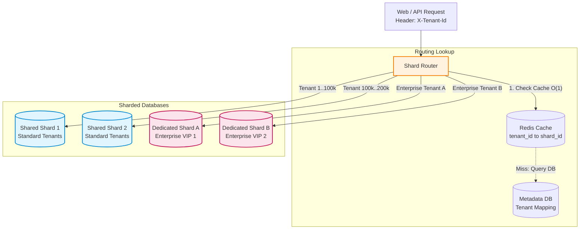
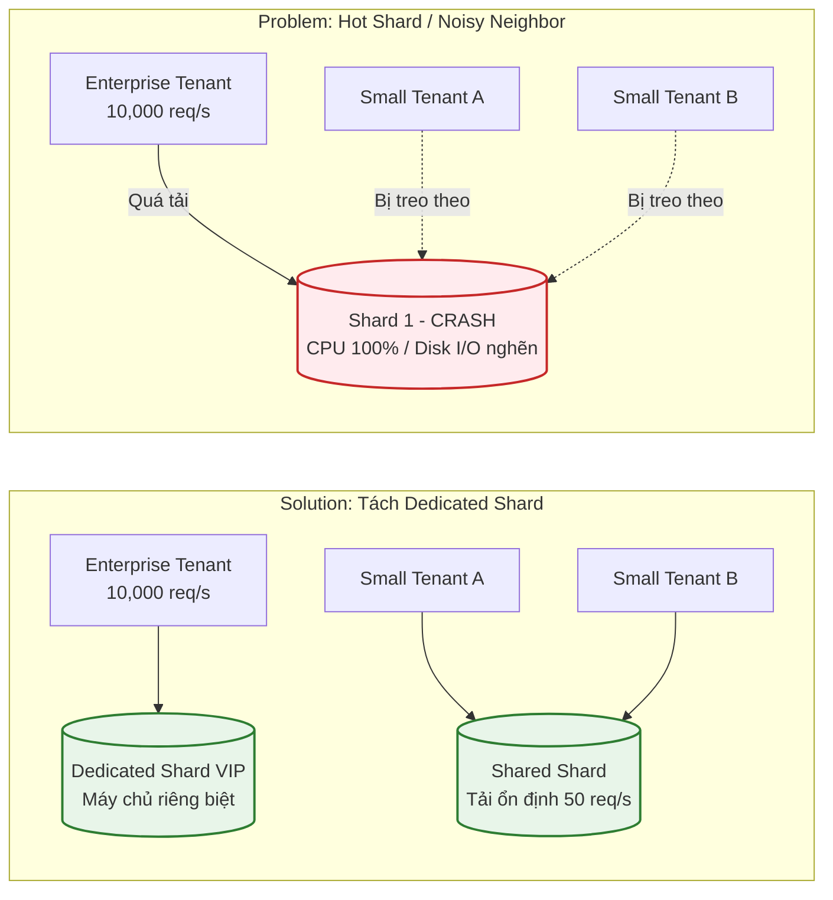

# Sharding Strategies & Challenges: Multi-tenant SaaS

Tài liệu so sánh các chiến lược phân mảnh dữ liệu (Hash-based, Range-based, Directory-based) và giải pháp thiết kế sharding cho hệ thống Multi-tenant SaaS quy mô 5 triệu tenants.

---

## Phần A — So sánh các chiến lược Sharding

| Tiêu chí | Hash-based | Range-based | Directory-based (Lookup Table) |
| :--- | :--- | :--- | :--- |
| Data distribution | Rất đều: Hàm hash rải đều dữ liệu ngẫu nhiên vào các shards. | Kém: Dễ bị dồn dữ liệu nếu khóa tăng dần (Auto-increment ID, Ngày tháng). | Linh hoạt 100%: Có thể chủ động phân bổ tenant vào shard mong muốn. |
| Range query | Rất kém: Các bản ghi liên tiếp bị phân tán khắp các shards --> Phải Scatter-Gather. | Rất tốt: Dữ liệu có giá trị gần nhau nằm chung 1 shard, scan range cực nhanh. | Kém: Phải tra cứu vị trí từng khóa qua bảng mapping trước khi query. |
| Hot spot risk | Thấp: Trừ khi 1 key riêng lẻ có lượng truy cập đột biến (Hot Key). | Rất cao: Toàn bộ write mới dồn vào shard cuối cùng (chứa ID/ngày mới nhất). | Rất thấp: Dễ dàng di dời tenant bị quá tải sang một shard chuyên dụng riêng. |
| Re-sharding complexity | Rất cao nếu dùng Modulo ($K \pmod N$). Trung bình nếu dùng Consistent Hashing. | Trung bình: Chỉ cần chia đôi (split) range của shard đang bị đầy. | Rất thấp: Chỉ cần di chuyển dữ liệu của tenant cần chuyển và update 1 dòng trong lookup table. |
| Routing complexity | Rất thấp (O(1)): Tính toán bằng hàm toán học trong RAM, không cần gọi database phụ. | Thấp (O(log N)): Tìm kiếm nhị phân trong bảng khoảng giá trị cấu hình sẵn. | Trung bình: Phải query bảng mapping (cần cache trên Redis để tránh bottleneck). |

---

## Phần B — Thiết kế Sharding cho Multi-tenant SaaS (5 triệu tenants)

### 1. Đề xuất kiến trúc tổng thể

- Shard Key: Chọn `tenantId`.
  - *Lý do:* 95%+ request trong hệ thống SaaS luôn đi kèm phạm vi khách hàng (`WHERE tenantId = ?`). Chọn `tenantId` đảm bảo 100% truy vấn nghiệp vụ của tenant là Single-shard Query (cực nhanh), đồng thời cô lập dữ liệu tuyệt đối giữa các khách hàng (Tenant Isolation).
- Strategy: Directory-based Sharding (Lookup Table có Cache trên Redis).
  - *Lý do:* Không thể dùng Hash-based vì có các Enterprise Tenant khổng lồ sẽ gây nghẽn shard chung (Noisy Neighbor). Directory-based cho phép linh hoạt chỉ định:
    - 5 triệu tenant nhỏ/vừa --> Xếp vào cụm Shared Shards.
    - Các Enterprise Tenant có traffic cực lớn --> Cấp riêng Dedicated Shard.

---

### 2. Diagram mô tả routing request theo Shard Key



- Quy trình định tuyến:
  1. Request gửi kèm `tenantId` (từ JWT Token hoặc Subdomain: `acme.saas.com`).
  2. Shard Router tra cứu nhanh trên Redis: `GET tenant:routing:<tenantId>` --> Lấy ra `shard_id` trong < 1ms.
  3. Mở kết nối thẳng tới Shard tương ứng để thực thi truy vấn.

---

### 3. Cách xử lý Hot Tenant (Enterprise Tenant) & Diagram tình huống

#### Tình huống Hot Shard (Vấn đề Noisy Neighbor):
Nếu dùng Hash-based ngẫu nhiên, một Enterprise Tenant (traffic 10,000 req/s) bị xếp chung shard với 10,000 tenant nhỏ. Toàn bộ CPU, RAM, Disk I/O của shard đó bị Enterprise Tenant chiếm dụng, khiến các tenant nhỏ bị treo theo.



#### Giải pháp xử lý:
1. Phát hiện: Giám sát lưu lượng (Prometheus / Datadog). Nếu 1 tenant vượt ngưỡng tài nguyên (ví dụ > 2,000 req/s hoặc > 500GB dữ liệu), hệ thống gắn nhãn `HOT_TENANT`.
2. Cô lập vào Dedicated Shard:
   - Cấp một cụm database độc lập riêng (Dedicated Shard) với tài nguyên phần cứng lớn hơn.
   - Di chuyển toàn bộ dữ liệu của tenant đó sang cụm riêng.
   - Cập nhật trong Directory Mapping trên Redis: `tenant_enterprise -> shard_dedicated_01`.
   - Các tenant nhỏ trên Shared Shards lập tức trở lại trạng thái hoạt động mượt mà.

---

### 4. Cách làm báo cáo tổng hợp Cross-tenant mỗi ngày

- Nguyên tắc: Tuyệt đối không chạy câu lệnh query phân tích trực tiếp trên các OLTP Shards (Vì câu query quét toàn bộ 5 triệu tenant sẽ làm cạn kiệt Connection Pool và CPU của hệ thống giao dịch).
- Giải pháp: Dùng Change Data Capture (CDC) sang Data Warehouse (OLAP):
  1. Mỗi khi có thao tác ghi trên các Shards, công cụ CDC (như Debezium / Kafka Connect) tự động đọc Write-Ahead Log (WAL/Binlog) và stream sự kiện về Kafka topic.
  2. Dữ liệu được đưa về cơ sở dữ liệu chuyên phân tích (Data Warehouse / OLAP như ClickHouse, BigQuery hoặc Snowflake).
  3. Báo cáo tổng hợp cuối ngày (chạy lúc 0h sáng) sẽ được thực thi trên Data Warehouse, hoàn toàn cách ly và không ảnh hưởng 0.01% hiệu năng tới hệ thống bán hàng trực tiếp.

---

### 5. Kế hoạch Re-sharding Zero-downtime khi số Tenant tăng

Khi các Shared Shards bắt đầu đầy dung lượng, hệ thống bổ sung thêm Shard mới và di dời một phần tenant sang mà không gây gián đoạn dịch vụ:

```
[Bước 1: Chuẩn bị]   --->   [Bước 2: Sync nền & Dual-Write]   --->   [Bước 3: Switch Route]   --->   [Bước 4: Cleanup]
Thêm Shard N+1              Snapshot data cũ + Sync CDC              Cập nhật Redis Key              Xóa data rác
                            (Hệ thống vẫn nhận Read/Write)           (Downtime < 1ms)                trên Shard cũ
```

1. Bước 1 — Chuẩn bị: Khởi tạo cụm database mới (Shard N+1).
2. Bước 2 — Đồng bộ dữ liệu nền (Background Catch-up):
   - Chọn ra danh sách các tenant cần chuyển đi (ví dụ Tenant 101 --> 200).
   - Snapshot dữ liệu cũ sang Shard N+1.
   - Sử dụng CDC (Debezium) để replicate liên tục các thay đổi phát sinh mới nhất từ Shard cũ sang Shard N+1 cho đến khi độ trễ sync bằng 0.
   - Trong suốt thời gian này, người dùng vẫn đọc/ghi bình thường trên Shard cũ.
3. Bước 3 — Chuyển đổi định tuyến tức thì (Instant Route Switch):
   - Cập nhật bảng ánh xạ trong Redis: Đổi giá trị `tenant_id` từ `shard_cu` thành `shard_N+1`.
   - Thao tác cập nhật key trong Redis chỉ mất < 1 mili-giây (Zero-downtime). Các request mới ngay lập tức được Router điều hướng sang Shard N+1.
4. Bước 4 — Dọn dẹp (Cleanup):
   - Sau khi Shard N+1 chạy ổn định 24h, xóa dữ liệu cũ của các tenant đã chuyển trên Shard cũ để giải phóng dung lượng đĩa.
